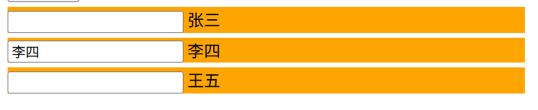

# Vue学习笔记

## react、vue中的key

### 作用

- 提供虚拟DOM的唯一标识
- 在Vue的列表渲染中，key 属性为每个列表项提供了一个唯一的标识符，用于Vue的虚拟DOM diff算法。
- 当数据更新时，Vue会根据新的数据生成新的虚拟DOM，并根据key比较新旧虚拟DOM的差异，在真实DOM中只需要更新差异部分。

### 对比规则

- 旧虚拟DOM中找到了与新虚拟DOM相同的key
    - 若虚拟DOM中内容没变, 直接使用之前的真实DOM
    - 若虚拟DOM中内容变了, 则生成新的真实DOM，随后替换掉页面中之前的真实DOM
- 旧虚拟DOM中未找到与新虚拟DOM相同的key
    - 创建新的真实DOM，随后渲染到到页面


### 使用key

- 不建议使用index索引作为key
  - 若对数据进行：逆序添加、逆序删除等破坏顺序操作
    - 会产生没有必要的真实DOM更新，界面效果没问题, 但效率低。
	- 如果结构中还包含输入类的DOM，会产生错误DOM更新，导致界面更新有问题
    - 仅作展示，使用index作为key是没有问题的


- 建议使用唯一标识作为key，如id


### index为key时输入框更新错误问题

- 核心原因
  - Vue只会更新文本内容，不会重新创建input元素
```html
<div id="root">
    <!-- 使用index作为key，当有输入框时，会导致界面更新错误 -->
        <div class="list">
        <button v-on:click="addUser">点击插入</button>
        <div class="item item4" v-for="(item, index) in userList" :key="index">
            <input type="text">
            <span>{{item.name}}</span>
        </div>
    </div>
</div>
<script type="text/javascript">
    new Vue({
        el:"#root",
        data:{
            userList: [
                {id:1, name:"张三"},
                {id:2, name:"李四"},
                {id:3, name:"王五"}
            ]
        },
        methods:{
            addUser(){
                this.userList.unshift({id:4, name:"老刘"})
            }
        }
    })
    a = [].unshift
</script>
```

- 初始状态
```js
    userList: [
    {id:1, name:"张三"},  // key=0
    {id:2, name:"李四"},  // key=1  
    {id:3, name:"王五"}   // key=2
    ]
```

- 插入"老刘"后（使用unshift在开头插入）
```js
  userList: [
    {id:4, name:"老刘"},  // key=0
    {id:1, name:"张三"},  // key=1
    {id:2, name:"李四"},  // key=2
    {id:3, name:"王五"}   // key=3
  ]
```
- 由于使用了index作为key，Vue会这样比较
```
  旧的虚拟DOM          新的虚拟DOM
  key=0: 张三          key=0: 老刘    → Vue认为是"同一个元素"，只更新文本
  key=1: 李四          key=1: 张三    → Vue认为是"同一个元素"，只更新文本(输入框还在这)
  key=2: 王五          key=2: 李四    → Vue认为是"同一个元素"，只更新文本
                      key=3: 王五    → 新增元素
```
- 结果,理应显示在第三个输入框中的李四,却显示在第二个输入框中
