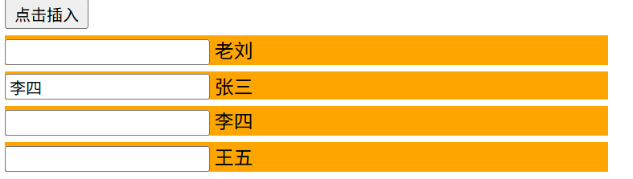
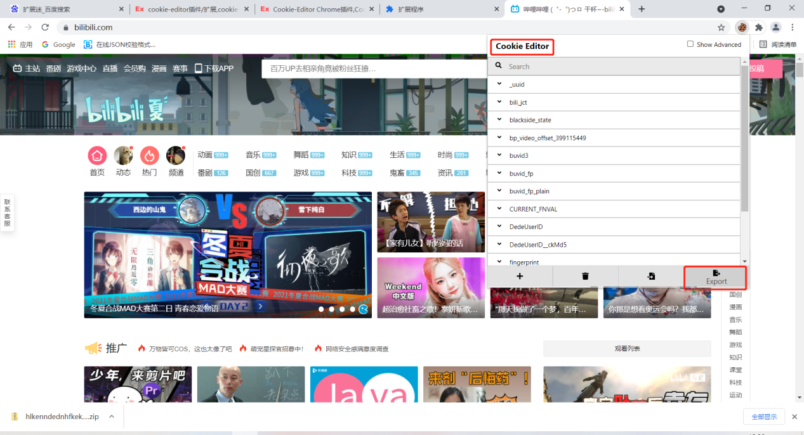
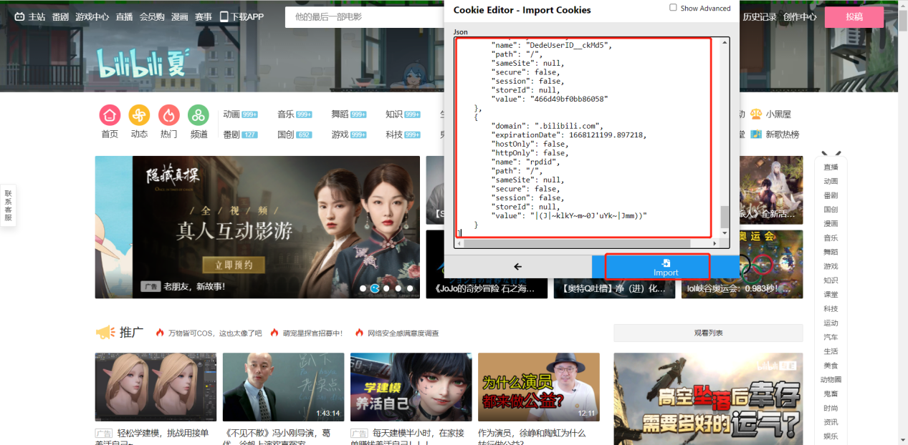

# Vue学习笔记

## react、vue中的key

### 作用

- 提供虚拟DOM的唯一标识
- 在Vue的列表渲染中，key 属性为每个列表项提供了一个唯一的标识符，用于Vue的虚拟DOM diff算法。
- 当数据更新时，Vue会根据新的数据生成新的虚拟DOM，并根据key比较新旧虚拟DOM的差异，在真实DOM中只需要更新差异部分。

### 对比规则

- 旧虚拟DOM中找到了与新虚拟DOM相同的key
    - 若虚拟DOM中内容没变, 直接使用之前的真实DOM
    - 若虚拟DOM中内容变了, 则生成新的真实DOM，随后替换掉页面中之前的真实DOM
- 旧虚拟DOM中未找到与新虚拟DOM相同的key
    - 创建新的真实DOM，随后渲染到到页面


### 使用key

- 不建议使用index索引作为key
  - 若对数据进行：逆序添加、逆序删除等破坏顺序操作
    - 会产生没有必要的真实DOM更新，界面效果没问题, 但效率低。
	- 如果结构中还包含输入类的DOM，会产生错误DOM更新，导致界面更新有问题
    - 仅作展示，使用index作为key是没有问题的


- 建议使用唯一标识作为key，如id


### index为key时输入框更新错误问题

- 核心原因
  - Vue只会更新文本内容，不会重新创建input元素
```html
<div id="root">
    <!-- 使用index作为key，当有输入框时，会导致界面更新错误 -->
        <div class="list">
        <button v-on:click="addUser">点击插入</button>
        <div class="item item4" v-for="(item, index) in userList" :key="index">
            <input type="text">
            <span>{{item.name}}</span>
        </div>
    </div>
</div>
<script type="text/javascript">
    new Vue({
        el:"#root",
        data:{
            userList: [
                {id:1, name:"张三"},
                {id:2, name:"李四"},
                {id:3, name:"王五"}
            ]
        },
        methods:{
            addUser(){
                this.userList.unshift({id:4, name:"老刘"})
            }
        }
    })
    a = [].unshift
</script>
```

- 初始状态
```js
    userList: [
    {id:1, name:"张三"},  // key=0
    {id:2, name:"李四"},  // key=1  
    {id:3, name:"王五"}   // key=2
    ]
```

- 插入"老刘"后（使用unshift在开头插入）
```js
  userList: [
    {id:4, name:"老刘"},  // key=0
    {id:1, name:"张三"},  // key=1
    {id:2, name:"李四"},  // key=2
    {id:3, name:"王五"}   // key=3
  ]
```
- 由于使用了index作为key，Vue会这样比较
```
  旧的虚拟DOM          新的虚拟DOM
  key=0: 张三          key=0: 老刘    → Vue认为是"同一个元素"，只更新文本
  key=1: 李四          key=1: 张三    → Vue认为是"同一个元素"，只更新文本(输入框还在这)
  key=2: 王五          key=2: 李四    → Vue认为是"同一个元素"，只更新文本
                      key=3: 王五    → 新增元素
```
- 结果,理应显示在第三个输入框中的李四,却显示在第二个输入框中


## cookie入狱教程


- 安装cookie-editor浏览器插件
- 登录某个网站
- 打开cookie-editor插件
- 点击export按钮导出



- 打开其他浏览器，进入某个网站
- 打开cookie-editor插件
- 点击import按钮导入之前导出的cookie


- 将内容粘贴到输入框导入



- 刷新即可登录成功

# Vue脚手架

- Vue 脚手架是Vue 官方提供的标准化开发工具（开发平台）
- [Vue CLI文档](https://cli.vuejs.org/zh/)

## 脚手架安装

- 全局安装Vue CLI
```bash
    npm install -g @vue/cli
```

## 脚手架创建项目

### 使用命令行创建项目

- 创建项目
```bash
    vue create 项目名
```
- 选择配置
  - Vue3默认配置（Vue3 + Babel + ESLint）
  - Vue2默认配置（Vue2 + Babel + ESLint）
  - 手动配置（一般选这个）
- 手动配置按需选择配置，按空格切换选中状态
  - Babel
  - TypeScript
  - Progressive Web App (PWA) Support
  - Router
  - Vuex
  - CSS Pre-processors
  - Linter / Formatter
  - Unit Testing
  - E2E Testing
- 选择版本
  - 3.x
  - 2.x
- 选择CSS预处理器
  - Sass/SCSS (with node-sass)
  - Less
  - Stylus
- 选择ESLint配置
  - ESLint with error prevention only（仅检查错误）
  - Airbnb（Airbnb代码规范）
  - Standard（Standard代码规范）
  - None（不使用ESLint）
- 选择Lint的特征
  - Lint on save（保存时检查）
  - Lint and fix on commit（提交时检查并修复）
- 选择配置文件
  - In dedicated config files（独立配置文件）
  - In package.json（package.json文件）

- 初始化依赖
  - 进入项目目录
  - 安装依赖
```bash
    npm i
```

- 安装依赖
```bash
    npm install xxx
```

### 使用vue可视化面板创建项目

- 打开vue可视化面板
```bash
    vue ui
```
- 点击创建
- 输入创建的目录：D:\文档\project\VueNote\Vue2
- 输入项目名（不能包含大小字母）：vue2clinote
- 选择手动配置项目
- 按需勾选第三方依赖（如：bable、router、linter/formatte、使用配置文件）
- 选择版本：2.x
- 选择ESLint配置：如Standard
- 选择Lint的特征：如Lint on save
- 创建项目
- 填写预设名：vue2clinote_preset

- 安装element/vant
  - 点击插件
  - 点击添加插件
  - 搜索element/vant
  - 选择vue-cli-plugin-element/vue-cli-plugin-vant
  - 点击安装

- 安装axios
  - 点击依赖
  - 点击安装依赖
  - 搜索axios
  - 选择axios
  - 点击安装

- 安装less-loader和less
  - 点击依赖
  - 点击安装依赖
  - 搜索less-loader和less
  - 选择less-loader和less
  - 点击安装
  - less-loader版本过高可能会报错，建议安装6.0版本（npm install less-loader@6.0.0）

### 修改配置

- 修改vue.config.js，打包用
```js
  const { defineConfig } = require('@vue/cli-service')
  module.exports = defineConfig({
    transpileDependencies: true,// Babel转译，将所有代码（包括依赖）转译为兼容的JavaScript代码
    // lintOnSave: false,// 关闭eslint校验
    publicPath: './',// 打包后的静态资源路径
  })
```

### 删除不必要的文件和代码

- 修改App.vue
```vue
    <template>
    <div id="app">
        app根组件
    </div>
    </template>

    <script>

    export default {
    name: 'App',
    }
    </script>

    <style>

    </style>
```

- 清空assets目录
- 清空components目录
- 修改router/index.js（如果有）
```js
  import Vue from 'vue'
  import Router from 'vue-router'

  Vue.use(Router)

  export default new Router({
    routes: [

    ]
  })
```

### 项目运行

- 阅读README.md文件，里面有些各种命令
- 运行项目
```bash
    npm run serve
```

### vue脚手架项目的目录结构说明

- node_modules：项目依赖的模块
- public：静态资源目录
  - favicon.ico: 页签图标
  - index.html：主页面
- src：项目的源代码目录
  - assets：静态资源目录
  - components：组件目录
  - router：路由目录
  - store：状态管理目录
  - utils：工具函数目录
  - views：视图组件目录
  - App.vue：根组件
  - main.js：入口文件
- .gitignore：git忽略文件
- babel.config.js：babel配置文件
- package-lock.json：依赖锁定文件
- package.json：项目依赖配置文件
- README.md：项目说明文件

# Vue UI 组件库

## PC 端常用UI 组件库

- [element-ui](https://element.eleme.cn/#/zh-CN/component/installation)
- [iviewui](https://www.iviewui.com/)

## 移动端常用UI 组件库

- [vant](https://vant-ui.github.io/vant/#/zh-CN)
- [mint-ui](https://mint-ui.github.io/docs/#/zh-cn2)
- [cube-ui](https://didi.github.io/cube-ui/#/zh-CN)