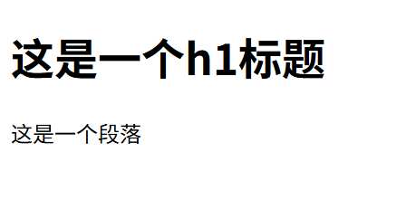
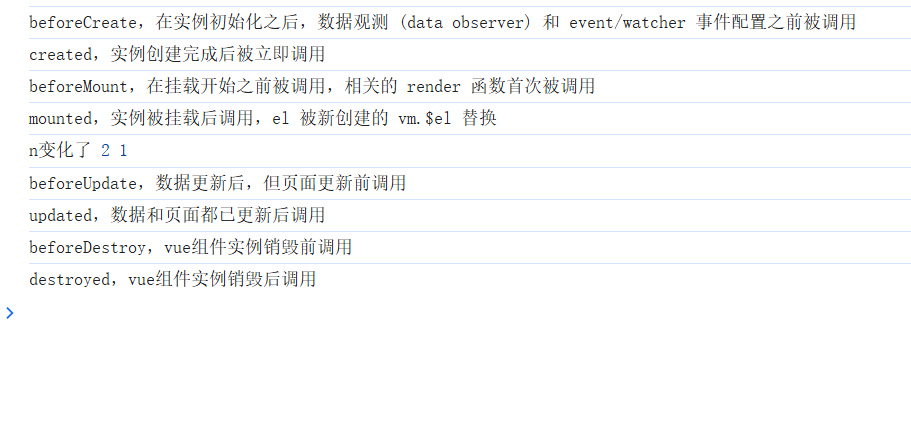
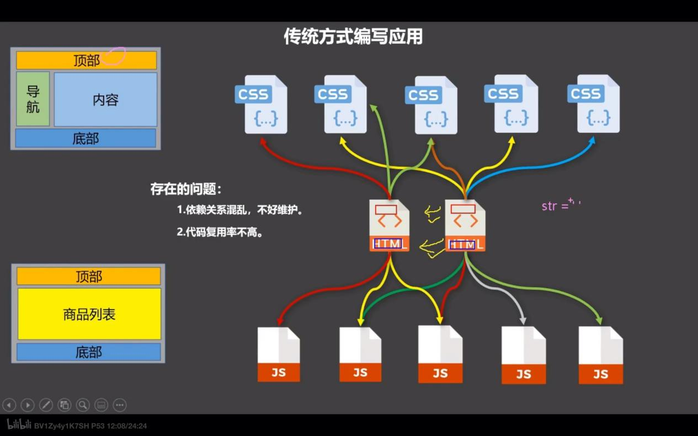

# 简介

- 动态构建用户界面的渐进式 JavaScript 框架

## 特点

- 采用组件化模式
  - 提高代码复用率，让代码更好的维护
- 声明式编码
  - 让编码人员无需直接操作 DOM，提高开发效率
- 使用虚拟 DOM 和优秀的 Diff 算法，尽可能提高性能
- 遵循 MVVM 模式
- 编码简洁, 体积小, 运行效率高, 适合移动/PC 端开发
- 它本身只关注 UI, 也可以引入其它第三方库开发项目

## 与其它 JS 框架的关联

- 借鉴 Angular 的模板和数据绑定技术
- 借鉴 React 的组件化和虚拟 DOM 技术

# 搭建Vue学习环境

- vue.js引入
  - [vue.js](https://cdn.bootcdn.net/ajax/libs/vue/2.7.9/vue.common.dev.js)
- 谷歌安装devtools插件
  - [Vue.js devtools](https://chromewebstore.google.com/detail/vuejs-devtools/nhdogjmejiglipccpnnnanhbledajbpd?utm_source=ext_app_menu)
- vscode插件
  - live server
  - Vue 3 Snippets

[学习环境搭建](./page/学习环境搭建.html)

# 创建Vue实例并绑定UI

- 创建一个根元素，并指定一个id，一般为root。该元素称为`Vue容器`
```html
  <body>
    <div id="root">
    </div>
  </body>
```

- 创建一个Vue实例，并传入一个配置对象
- 配置对象的属性
  - el：用于指定当前Vue实例为哪个容器服务，值通常为css选择器字符串，一般为#root
  - data：用于存储数据。数据供el所指定的容器去使用，值暂时写成对象
  - 当data中的数据发生改变，页面中用到该数据的UI也会自动更新
```js
  //创建vue实例，传入配置对象
  new Vue({
      el:"#root",// el用于指定当前Vue实例为哪个容器服务，值通常为css选择器字符串
      // el:document.getElementById("root");//可以这么写，但一般不这么写
      // data数据，用于存储数据。数据供el所指定的容器去使用，值暂时写成对象
      data:{
          name:"KenSen",
          age:18
      }
  });
```

## 相关概念

- Vue容器里的代码依然符合html规范，只不过混入了一些特殊的Vue语法
- Vue容器里的代码被称为`Vue模板`
- Vue实例和Vue容器是一一对应的
- 真实开发中只有一个Vue实例，并且会配合着组件一起使用

[创建Vue实例并绑定UI](./page/创建Vue实例并绑定UI.html)


# 模板语法

- Vue模板语法有2大类：
  - 插值语法
    - （双大括号表达式）
    - 用于解析标签体内容
    - {{xxx}} ，xxx 会作为js 表达式解析
  - 指令语法
    - （v-xxx）
    - 解析标签属性、解析标签体内容、绑定事件
    - v-bind:href = 'xxx' ，xxx 会作为js 表达式被解析
```html
  <div id="root">
      <!-- 插值语法 -->
      <h1>{{userInfo.name}}</h1>
      <!-- 指令语法 -->
      <a v-bind:href="userInfo.github">github</a>
      <!-- v-bind的简写 -->
      <a :href="userInfo.github">github简写</a>
  </div>
  <script type="text/javascript">
      //全局配置，阻止 vue 在启动时生成生产提示
      Vue.config.productionTip = false;
      new Vue({
          el:"#root",
          data:{
              userInfo: {
                  name:"KenSen",
                  age:18,
                  github:"https://github.com/kunchengi"
              }
          }
      });
  </script>
```

[模板语法](./page/模板语法.html)


# 数据绑定

- 数据和UI的绑定,当数据发生改变，页面中用到该数据的UI也会自动更新
- data中的数据是可以深度绑定的,比如data中的user属性是对象,当user的对象内部的属性发生改变，页面中用到该数据的UI也会自动更新
- Vue中有2种数据绑定的方式
  - 单向绑定(v-bind)
    - 数据只能从data流向页面
    - 数据更新会驱动UI更新，但是UI更新不会驱动数据更新
    - 语法：v-bind:xxx = 'xxxx' ，xxxx 是data中的属性，xxx 是元素中的属性
    - 简写：:xxx = 'xxxx'
  - 双向绑定(v-model)
    - 数据既能从data流向页面，又能从页面流向data
    - UI更新会驱动数据更新，数据更新也会驱动UI更新
    - 语法：v-model:xxx = 'xxxx' ，xxxx 是data中的属性，xxx 是元素中的属性
    - v-model只能用在表单类元素上（如：input、select等）
    - v-model:value 可以简写为 v-model，因为v-model默认收集的就是value值
    - 在 Vue 2 中，使用 v-model 绑定 input 元素时，默认情况下 input 的值会被当作字符串（string）处理。
    - 即使在 input 上设置了 type="number"，v-model 依然会把输入的内容当作字符串来存储到 data 里的 firstNumber 和 secondNumber。
    - 解决办法：使用v-model.number
```html
  <div id="root">
      <!-- 普通写法 -->
      <input type="text" v-bind:value="name"><br/>
      <input type="text" v-model:value="name"><br/>

      <!-- 简写 -->
      <input type="text" :value="name"><br/>
      <input type="text" v-model="name"><br/>
      <button v-on:click="name = '张三'">点击修改name值</button>

      <!-- 以下代码是错误的，因为v-model只能应用在表单类元素（输入类元素）上 -->
      <!-- <h2 v-model:x="name">你好啊</h2> -->
  </div>
  <script src="https://cdn.bootcdn.net/ajax/libs/vue/2.7.9/vue.common.dev.js"></script>
  <script type="text/javascript">
      //全局配置，阻止 vue 在启动时生成生产提示
      Vue.config.productionTip = false;
      new Vue({
          el:"#root",
          data:{
              name:"KenSen"
          }
      });
  </script>
```

[数据绑定](./page/数据绑定.html)


# el与data的两种写法

- el的两种写法
  - 方式一：new Vue时候配置el属性
  - 方式二：先创建Vue实例，随后再通过$mount('#root')指定el
- data的两种写法
  - 对象式
  - 函数式
  - 目前哪种写法都可以，以后学习到组件时，data必须使用函数式，否则会报Vue警告
- 由Vue管理的函数，一定不要写箭头函数，一旦写了箭头函数，this就不再是Vue实例了
```js
  new Vue({
      // 方式一：new Vue时候配置el属性
      el:"#root",
      // 对象式
      data:{
          name:"KenSen"
      }
  });
  // 方式二：先创建Vue实例，随后再通过$mount('#root')指定el
  new Vue({
      // 函数式
      data(){
          console.log(this);// 此处的this是Vue实例
          return {
              name:"KenSen"
          }
      }
  }).$mount('#root');
```
[el与data的两种写法](./page/el与data的两种写法.html)

## MVVM模型

- M：模型(Model)
  - 数据层
  - 对应Vue中的data数据
- V：视图(View)
  - 视图层
  - 对应Vue中的模板
- VM：视图模型(ViewModel)
  - 连接M和V的桥梁
  - 对应Vue中的Vue实例


- data中所有的属性，最后都出现在了vm身上
- vm身上所有的属性 及 Vue原型上所有属性，在Vue模板中都可以直接使用

# Vue2中的数据代理

- 通过vm对象来代理data对象中属性的操作（读/写）
- Vue2中的数据代理是通过Object.defineProperty()方法来实现的
- Vue中数据代理的好处
  - 更方便的操作data中的数据
- 基本原理
  - 通过Object.defineProperty()把data对象中所有属性添加到vm上
  - 为每一个添加到vm上的属性，都指定一个getter/setter
  - 在getter/setter内部去操作data中对应的属性


# 事件处理

## 事件的基本使用

- 使用v-on:xxx 或 @xxx 绑定事件，其中xxx是事件名
- @click="demo" 和 @click="demo()" 效果一致
- @click="demo($event, 666)" 中如果同时传入了$event，则会被解析为原生事件对象
- methods对象
  - 是一个Vue实例对象，用于给Vue实例对象添加方法，但不会做数据代理
  - 事件的回调需要配置在methods对象中，最终会在vm上
  - methods中配置的函数，都是被Vue所管理的函数，this的指向是vm 或 组件实例对象，不要用箭头函数！否则this就不是vm了
  - 如果将方法写到data里，也能使用，但是会做数据代理，可能会降低性能

```html
  <div id="root">
      <button v-on:click="showInfo">v-on点我提示信息,不传参</button>
      <button @click="showInfo">@click点我提示信息1不传参,简写形式</button>
      <button @click="showInfo1(66)">点我提示信息2,传参，但不传事件对象</button>
      <button @click="showInfo2($event,66)">点我提示信息2,传参，传事件对象</button>
  </div>
  <script src="https://cdn.bootcdn.net/ajax/libs/vue/2.7.9/vue.common.dev.js"></script>
  <script type="text/javascript">
      Vue.config.productionTip = false;
      new Vue({
          el:"#root",
          data:{
              name:"KenSen"
          },
          methods:{
              showInfo(){
                  console.log('this',this);//此处的this是Vue实例
                  console.log('showInfo');// showInfo
              },
              showInfo1(number){
                  console.log('number',number);// 66
              },
              showInfo2(event,number){
                  console.log('event',event);// 事件对象
                  console.log('number',number);// 66
              }
          }
      });
  </script>
```

[事件的基本使用](./page/事件的基本使用.html)

## 事件修饰符

- prevent
  - 阻止事件的默认行为
  - 相当于event.preventDefault()

- stop
  - 阻止事件冒泡
  - 相当于event.stopPropagation()

- once
  - 事件只触发一次

- 修饰符可以连着写，有先后顺序
  - @click.prevent.stop.once = "demo"

- capture
  - 事件捕获阶段触发

- self
  - 事件只触发自身

- passive
  - 事件的默认行为立即执行，无需等待事件回调执行完毕

```html
    <div id="root">
        <!-- 原生js阻止默认事件 -->
        <a href="http://www.atguigu.com" @click="showInfo($event)">原生js阻止默认事件</a>
        <!-- prevent修饰符阻止默认事件 -->
        <a href="http://www.atguigu.com" @click.prevent="showMsg(66)">prevent修饰符阻止默认事件</a>
        <!-- 原生js阻止事件冒泡 -->
        <div class="demo1" @click="showInfo($event)">
            <button @click="showInfo($event)">原生js阻止事件冒泡</button>
        </div>  
        <!-- stop修饰符阻止事件冒泡 -->
        <div class="demo1" @click="showInfo">
            <button @click.stop="showInfo">stop修饰符阻止事件冒泡</button>
            <!-- 修饰符可以连续写 -->
            <!-- <a href="http://www.atguigu.com" @click.prevent.stop="showInfo">点我提示信息</a> -->
        </div>
        <!-- once事件只触发一次 -->
        <button @click.once="showInfo">once事件只触发一次</button>
        <!-- capture使用事件的捕获模式，捕获阶段开始处理事件 -->
        <div class="box1" @click.capture="showMsg(1)">
            capture使用事件的捕获模式，捕获阶段开始处理事件
            <div class="box2" @click="showMsg(2)">
                div2
            </div>
        </div>
        <!-- self只有event.target是当前操作的元素时才触发事件 -->
        <div class="demo1" @click.self="showInfo">
            <button @click="showInfo">self只有event.target是当前操作的元素时才触发事件</button>
        </div>
        <!-- @wheel是鼠标滚轮滚动事件，事件的默认行为立即执行，无需等待事件回调执行完毕； -->
        <ul @wheel.passive="demo" class="list">
            <li>1</li>
            <li>2</li>
            <li>3</li>
            <li>4</li>
        </ul>
    </div>
    <script src="https://cdn.bootcdn.net/ajax/libs/vue/2.7.9/vue.common.dev.js"></script>
    <script type="text/javascript">
        Vue.config.productionTip = false;
        new Vue({
            el:"#root",
            data:{
                name:"KenSen"
            },
            methods:{
                showInfo(e){
                    //原生js阻止浏览器默认行为
                    e.preventDefault();
                    //原生js阻止事件冒泡
                    e.stopPropagation();
                    console.log('showInfo');
                },
                showMsg(msg){
                    console.log(msg);
                },
                demo(){
                    console.log('demo');
                }
            }
        });
    </script>
```

[事件修饰符](./page/事件修饰符.html)

## 键盘事件

- Vue中常用的按键别名
  - 回车 => enter
  - 删除 => delete (捕获“删除”和“退格”键)
  - 退出 => esc
  - 空格 => space
  - 换行 => tab (特殊，必须配合keydown去使用)
  - 上 => up
  - 下 => down
  - 左 => left
  - 右 => right

- 系统修饰键（用法特殊）：ctrl、alt、shift、meta
  - 配合keyup使用时
    - 按下修饰键的同时，再按下其他键，随后释放其他键，事件才被触发
  - 配合keydown使用
    - 正常触发事件
- 也可以使用keyCode去指定具体的按键（不推荐）
- 自定义按键别名
  - 在Vue.config.keyCodes中自定义按键别名
  - 自定义别名建议使用全小写，否则可能不生效
```html
  <div id="root">
      <input type="text" placeholder="按下键盘就会触发事件" @keydown="showInfo">
      <input type="text" placeholder="按下回车键就会触发事件" @keydown.enter="showInfo">
      <input type="text" placeholder="按下F9键就会触发事件" @keydown.fnine="showInfo">
      <input type="text" placeholder="按下Ctrl+Y键就会触发事件" @keyup.ctrl.y="showInfo">
  </div>
  <script src="https://cdn.bootcdn.net/ajax/libs/vue/2.7.9/vue.common.dev.js"></script>
  <script type="text/javascript">
      Vue.config.productionTip = false;
      // 自定义F9按键别名
      Vue.config.keyCodes.fnine = 120;
      console.log(Vue.config.keyCodes);
      new Vue({
          el:"#root",
          data:{
              name:"KenSen"
          },
          methods:{
              showInfo(e){
                  console.log(e.key,e.keyCode);
              }
          }
      });
  </script>
```

[键盘事件](./page/键盘事件.html)

# 计算属性

- 求和案例
  - 当输入框的值发生改变，实时显示求和的结果

- 通过已有的属性，计算出一个新的属性
- 原理
  - 借助了Objcet.defineproperty方法提供的getter和setter，当数据发生改变时，会自动调用getter和setter，重新计算出一个新的属性
- 计算属性的函数执行时机
  - 初次读取时会执行一次
  - 当依赖的数据发生改变时会被再次调用
- 优势
  - 与其它实现方式相比，内部有缓存机制（复用），效率更高，调试方便
- 计算属性最终会出现在vm上，直接读取使用即可
- 如果计算属性要被修改，那必须写set函数去响应修改，且set中要引起计算时依赖的数据发生改变
- 使用
  - 通过computed配置项给vm添加计算属性
  - computed是对象，对象中配置的属性称为计算属性
  - 计算属性需要配置get方法，get方法需要返回计算后的结果
  - 计算属性可以被修改，必须写set方法，set方法需要传入修改后的值。且要在set中更新依赖的数据
  - 当计算属性不需要set方法时，可以简写成一个函数，返回计算后的结果，相当于get方法
```html
  <div id="root">
      <input type="number" v-model.number="firstNumber">
      <input type="number" v-model.number="secondNumber">
      <span>{{sum}}</span>
      <button @click="sum++">点我sum加1</button>
  </div>
  <script src="https://cdn.bootcdn.net/ajax/libs/vue/2.7.9/vue.common.dev.js"></script>
  <script type="text/javascript">
      Vue.config.productionTip = false;
      new Vue({
          el:"#root",
          data:{
              firstNumber:0,
              secondNumber:0
          },
          // 计算属性
          computed:{
              // 定义sum计算属性
              sum:{
                  // 定义sum的get方法，初次读取时会执行一次，当依赖的数据发生改变时会被再次调用
                  get(){
                      return this.firstNumber + this.secondNumber;
                  },
                  // 定义sum的set方法，当sum被修改时会执行
                  set(value){
                      this.firstNumber = value - this.secondNumber;
                  }
              }
          }
      });
  </script>
```

[计算属性](./page/计算属性.html)


# 监视属性

- 作用
  - 当被监视的属性变化时，会自动执行监视属性中的函数
  - 与计算属性不同，当数据发生变化时,watch可以执行异步操作,处理复杂的逻辑

## 浅监视

- 可以监视data/computed中的属性
- 监视的两种写法
  - new Vue时传入watch配置
  - 通过vm.$watch(属性名，回调)
- 浅监视只会监视data/computed属性的属性值，如果属性值是一个对象，那么只会监视对象最外层属性的变化，属性的属性值变化时，不会触发监视属性中的handler函数。类似浅拷贝
- immediate为true时，初始化时会调用handler函数
```js
  const vm = new Vue({
      el: "#root",
      data: {
          isHot: true,
          user: {
              name: '张三',
              age: 18
          }
      },
      computed: {
          weather() {
              return this.isHot ? '炎热' : '凉爽';
          }
      },
      methods: {
          changeWeather() {
              this.isHot = !this.isHot;
          },
          changeUser() {
              this.user = {
                  name: '王五',
                  age: 20
              }
          },
          addAge() {
              this.user.age++;
          }
      },
      // 监视属性写法1
      watch: {
          // 监视isHot数据的变化
          isHot: {
              immediate: true, // 初始化时让handler调用一下
              // handler函数：当isHot发生改变时被调用
              handler(newValue, oldValue) {
                  console.log('isHot被修改了', newValue, oldValue);
              }
          },
          // 监视计算属性weather的变化
          weather: {
              handler(newValue, oldValue) {
                  console.log('天气变化了', newValue, oldValue);
              }
          },
          // 监视对象属性的变化
          user: {
              handler(newValue, oldValue) {
                  console.log('用户数据被修改了', newValue, oldValue);
              }
          }
      }
  });
  // 监视属性写法2
  // vm.$watch('isHot',{
  //     handler(newValue, oldValue) {
  //         console.log('isHot被修改了', newValue, oldValue);
  //     }
  // })
  // vm.$watch('weather',{
  //     handler(newValue, oldValue) {
  //         console.log('天气变化了', newValue, oldValue);
  //     }
  // })
```

[浅监视](./page/浅监视.html)


## 深度监视

- 监视对象中的属性值，如果属性值是一个对象，那么会监视对象中的属性值，属性值是一个对象，那么会继续监视对象的属性值，以此类推，会进行深度监视
- 在配置项中添加deep: true即可
```js
  watch: {
      // 监视对象属性的变化
      user: {
          // 深度监视
          deep: true,
          handler(newValue, oldValue) {
              console.log('用户数据被修改了', newValue, oldValue);
          }
      }
  }
```

[深度监视](./page/深度监视.html)


## 监视属性的简写

- 如果不需要深度监视，可以不写配置，简写为函数形式
- 监视属性写法1和写法2的写法可以进行简写
```js
  const vm = new Vue({
      el: "#root",
      data: {
          isHot: true,
      },
      computed: {
          weather() {
              return this.isHot ? '炎热' : '凉爽';
          }
      },
      methods: {
          changeWeather() {
              this.isHot = !this.isHot;
          }
      },
      // 监视属性简写1
      watch: {
          // 监视isHot数据的变化
          isHot(newValue, oldValue){
              console.log('isHot被修改了', newValue, oldValue);
          }
      }
  });
  // 监视属性简写2
  // vm.$watch('isHot', function(newValue, oldValue) {
  //     console.log('isHot被修改了', newValue, oldValue);
  // });
```

[监视属性的简写](./page/监视属性的简写.html)

## watch与computed对比

- computed能完成的功能，watch都可以完成
- computed有缓存，watch没有缓存
- watch能完成的功能，computed不一定能完成，比如异步逻辑
```js
  watch: {
      // 监视属性完成异步操作，1秒后再更新天气
      isHot(newValue, oldValue){
          setTimeout(() => {
            this.weather = newValue ? '炎热' : '凉爽';
          },1000)
      }
  }
```

## vue中的普通函数和箭头函数

- 所被Vue管理的函数，要写成普通函数，这样this的指向才是vm 或 组件实例对象。
- 所有不被Vue所管理的函数（定时器的回调函数、ajax的回调函数等、Promise的回调函数），最好写成箭头函数，这样this的指向才是vm 或 组件实例对象

# 样式绑定

- 用于绑定和修改元素的class和style属性，实现动态切换样式

## class 绑定

- 语法1：`:class="className"`
  - className为样式类名
- 语法2：`:class="{className:isA,className2:isB,className3:isC,...}"`
  - className、className2、className3...为样式类名
  - isA、isB、isC...为布尔值，为元素的class是否生效
- 语法3：`:class="[className,className2,className3]"`
  - className、className2、className3...为样式类名

## style 绑定

- 语法1：`:style="{fontSize: xxx}"`
  - xxx为vue中的变量
- 语法2：`:style="[obj1,obj2]"`
  - obj1、obj2为对象，为元素的style属性

```html
  <div id="root">
      <button @click="changeMood">切换box1样式</button><br/>
      <div class="basic" :class="mood" @click="changeMood">box1</div> <br/>
      <div class="basic" :class="classArr">box2</div> <br/>
      <button @click="changeShadow">切换box3的字体阴影</button><br/>
      <div class="basic" :class="classObj">box3</div> <br/>
      <button @click="changeFontSize">切换box4、box5的字体大小</button><br/>
      <div class="basic" :style="styleObj">box4</div> <br/>
      <div class="basic" :style="styleArr">box5</div>
  </div>
  <script src="https://cdn.bootcdn.net/ajax/libs/vue/2.7.9/vue.common.dev.js"></script>
  <script type="text/javascript">
      Vue.config.productionTip = false;
      new Vue({
          el:"#root",
          data:{
              mood: 'normal',
              isShadow: false,
              styleSize: 30,
              classArr: ['bgColor', 'textShadow', 'borderRadius'],
          },computed: {
              classObj() {
                  return {
                      bgColor: true,
                      textShadow: this.isShadow,
                      borderRadius: true
                  }
              },
              styleObj() {
                  return {
                      color: 'red',
                      fontSize: `${this.styleSize}px`
                  }
              },
              styleArr() {
                  return [{color: 'red'}, {fontSize: `${this.styleSize}px`}]
              }
          },
          methods: {
              changeMood() {
                  const arr = ['happy', 'sad', 'normal'];
                  const index = arr.findIndex(item => item === this.mood);
                  this.mood = arr[(index + 1) % 3];
              },
              changeShadow() {
                  this.isShadow = !this.isShadow;
              },
              changeFontSize() {
                  this.styleSize += 2;
              }
          }
      });
  </script>
```

[样式绑定](./page/样式绑定.html)


# 条件渲染

## 条件渲染语法

- v-if
  - 适用于切换频率较低的场景
  - 不展示的DOM元素直接被移除
  - v-if可以和:v-else-if、v-else一起使用，但要求结构不能被“打断”
  ```html
    <div v-if="isShow">条件渲染</div>
    <div v-else-if="isShow2">条件渲染2</div>
    <div v-else>条件渲染3</div>
  ```

- v-show
  - 切换频率较高的场景
  - 不展示的DOM元素，不会被移除，只会隐藏。即：display: none
  ```html
    <div v-show="isShow">条件渲染</div>
  ```

## v-if和v-show

- v-if和v-show都是用于条件渲染的，但两者之间有区别
  - v-if的元素，在为flase时，DOM元素会被直接移除，所有子节点不会解析
  - v-show的元素，在为flase时，DOM元素不会被移除，只是将元素隐藏，即：display: none
  - 如果需要频繁切换应使用v-show

[条件渲染](./page/条件渲染.html)


# 列表渲染

## 基本列表渲染

- v-for
  - 可遍历：数组、对象、字符串（用的很少）、指定次数（用的很少）
  - key：用于虚拟DOM的优化，作用：当数据更新时，Vue会根据新的数据生成新的虚拟DOM，并比较新旧虚拟DOM的差异，最后将差异同步到真实DOM中
  - key必须在列表中唯一，不要使用索引作为key
```html
  <!-- 渲染数组 -->
  <!--第一个参数p是数组值，第二个参数index是数组索引-->
  <!-- <div class="item item1" v-for="item in userList" :key="item.id">{{item.name}}</div> -->
  <div class="item item1" v-for="(item,index) in userList" :key="item.id">{{item.name}}-{{index}}</div>

  <!-- 渲染对象 -->
  <!--第一个参数value是属性值，第二个参数k是属性名-->
  <div class="item item2" v-for="(value, k) in car" :key="k">{{value}}-{{k}}</div>

  <!-- 渲染字符串 -->
  <!--第一个参数char是字符值，第二个参数index是字符串索引-->
  <div class="item item3" v-for="(item, index) in message" :key="index">{{item}}-{{index}}</div>

  <!-- 渲染数值 -->
  <!--第一个参数number是数值，第二个参数index是数值索引，3是遍历次数-->
  <div class="item item4" v-for="(item, index) in 3" :key="index">{{item}}-{{index}}</div>
```

[基本列表渲染](./page//列表渲染/基本列表渲染.html)


## 列表过滤案例

- 在搜索框按名字模糊查询，并显示查询结果
```html
  <div id="root">
      <div>
          <input type="text" placeholder="请输入名字" v-model="keyword">
          <h1>监视属性实现</h1>
          <div v-for="item in filterList">
              {{item.name}}-{{item.age}}-{{item.sex}}
          </div>
          <h1>计算属性实现</h1>
          <div v-for="item in filterList1">
              {{item.name}}-{{item.age}}-{{item.sex}}
          </div>
      </div>
  </div>
  <script src="https://cdn.bootcdn.net/ajax/libs/vue/2.7.9/vue.common.dev.js"></script>
  <script type="text/javascript">
      new Vue({
          el:"#root",
          data:{
              keyword:"",
              list:[
                  {id:'001',name:'马冬梅',age:19,sex:'女'},
                  {id:'002',name:'周冬雨',age:20,sex:'女'},
                  {id:'003',name:'周杰伦',age:21,sex:'男'},
                  {id:'004',name:'温兆伦',age:22,sex:'男'}
              ],
              // 监视属性实现，保存过滤结果的数组
              filterList:[]
          },
          watch:{
              // 监视属性实现，监听keyword属性。有值变化时，更新filterList属性
              keyword: {
                  immediate:true,
                  handler(newValue,oldValue){
                      // 获取过滤结果
                      this.filterList = this.list.filter(item => item.name.indexOf(newValue) !== -1)
                  }
              }
          },
          computed:{
              // 计算属性实现，监听keyword属性。有值变化时，更新filterList属性
              filterList1(){
                  return this.list.filter(item => item.name.indexOf(this.keyword) !== -1)
              }
          }
      })
  </script>
```

[列表过滤案例](./page/列表渲染/列表过滤案例.html)


# Vue2 属性监视机制解析

## 核心原理

- Vue 在初始化时`递归遍历` data 对象的所有属性（包括嵌套对象中的属性）
- 使用 Object.defineProperty() 将每个属性转换为 getter/setter
- 每个组件实例都有对应的 watcher 实例，在属性被访问时收集依赖
- 当属性值变化时，setter 会通知 watcher，从而触发重新渲染
- Vue没有对数组的索引进行getter/setter转换（出于性能考虑），而是通过重写数组的7个方法（push、pop、shift、unshift、splice、sort、reverse）来实现响应式。

[简化版属性监视机制实现](./page/属性监视机制/简化版属性监视机制实现.html)

## 无法检测属性添加

- 直接新增属性，不会驱动UI更新
- 解决方式：使用vm.$set()方法新增属性，会驱动UI更新
```js
  // 直接新增属性，不会驱动UI更新
  this.user.email = 'example@mail.com';
  // 正确做法：使用 Vue.set 或 this.$set
  this.$set(this.user, 'email', 'example@mail.com');
```

## 无法检测属性删除

- 直接删除属性，不会驱动UI更新
- 解决方式：使用vm.$delete()方法删除属性，会驱动UI更新
```js
  // 直接删除属性，不会驱动UI更新
  delete this.user.name;
  // 正确做法：使用 Vue.delete 或 this.$delete
  this.$delete(this.user, 'name');
```

## 数组的限制

- 通过索引替换数组中的元素，不会驱动UI更新
- 直接修改数组的length属性，不会驱动UI更新
- 解决方式1：使用数组的方法修改数组
- 解决方式2：使用vm.$set()方法修改数组
```js
  // 通过索引替换数组中的元素，不会驱动UI更新
  // this.userList[0] = {id:1, name:"老刘", age:18};
  // 直接修改数组的length属性，不会驱动UI更新
  // this.userList.length = 0;
  // 通过数组的方法替换数组中的元素，会驱动UI更新
  // this.userList.splice(0,1,{id:1, name:"老刘", age:18});
  // 通过vm.$set()方法替换数组中的元素，会驱动UI更新
  this.$set(this.userList,0,{id:'1',name:'老刘',age:18});
```

## Vue.set的使用

- Vue.set()方法的使用
  - Vue.set(target, key, value)
  - target: 目标对象
  - key: 要添加的属性名(数组索引或对象属性名)
  - value: 要添加的属性值
```js
  this.$set(this.user, 'email', 'example@mail.com');
  this.$set(this.userList,0,{id:'1',name:'老刘',age:18});
```

## Vue.delete的使用

- Vue.delete()方法的使用
  - Vue.delete(target, key)
  - target: 目标对象
  - key: 要删除的属性名(数组索引或对象属性名)
```js
  this.$delete(this.user, 'email');
  this.$delete(this.userList,0);
```

[vue监视属性机制的问题](./page/属性监视机制/vue监视属性机制的问题.html)


# v-model详解

## 绑定输入框

- 若绑定在输入框上，v-model收集的值和用户输入的值为输入框中的value值
```html
  <input type="text" v-model="name">
```

## 绑定单选框

- 若绑定在单选框上，v-model收集的值和用户选择的值为单选框的value值
```html
  <input type="radio" v-model="sex" value="男">男
  <input type="radio" v-model="sex" value="女">女
```

## 绑定复选框

- 如果绑定的数据为非数组，则v-model将会把绑定数据转换成boolean值，然后绑定给复选框的checked属性
```html
  <input type="checkbox" v-model="isSure">是否同意协议
```
- 如果绑定的数据为数组，则v-model会把复选框选中的value值收集到数组中
```html
  <input type="checkbox" v-model="hobby" value="篮球">篮球
  <input type="checkbox" v-model="hobby" value="足球">足球
```

## v-model的三个修饰符

- .lazy
  - 失去焦点时才会更新数据
```html
  <input type="text" v-model.lazy="name">
```
- .number
  - 自动将用户输入的值转换为数字类型
```html
  <input type="text" v-model.number="age">
```
- .trim
  - 自动过滤用户输入的首尾空格
```html
  <input type="text" v-model.trim="name">
```

[v-model详解](./page/v-model详解.html)


# 过滤器

- 过滤器的作用
  - 对要显示的数据进行特定格式化后再显示
  - 过滤器可以用在两个地方：{{}}插值表达式和v-bind表达式
  - 并没有改变原本的数据, 是产生新的对应的数据
- 过滤器的定义
  - 全局过滤器：Vue.filter(name, callback)
  ```js
  Vue.filter('mySlice', function (value, length = 4) {
    return value.slice(0, length)
  })
  ```
  - 局部过滤器：new Vue({filters:{name:callback}})
  ```js
  new Vue({
    el: '#root',
    data: {
      msg: 'hello vue',
      time: new Date()
    },
    filters: {
      mySlice: function (value, length = 4) {
        return value.slice(0, length)
      }
    }
  })
  ```
- 过滤器的使用
  - 表达式得到的结果会作为参数传递给过滤器函数，然后返回处理后的结果
  - 插值表达式：{{ 表达式 | 过滤器名 }}
  ```html
    <h3>{{msg | mySlice}}</h3>
  ```
  - v-bind:属性 = "表达式 | 过滤器名"
  ```html
    <h3 v-bind:title="msg | mySlice">鼠标悬停查看title</h3>
  ```
  - 可传递其他参数
  ```html
    <h3>{{msg | mySlice(5)}}</h3>
  ```
  - 可以串联：{{ 表达式 | 过滤器名1 | 过滤器名2 }}
  ```html
    <h3>{{msg | mySlice | myUpper}}</h3>
  ```

[过滤器](./page/过滤器.html)


# 内置指令与自定义指令

## v-text
- 作用：更新元素的textContent
- 语法：v-text="表达式"
- 与插值表达式的区别
  - v-text会替换掉元素中的内容，{{}}则不会
```html
  <!-- msg的值会将p标签中的内容替换掉 -->
  <p v-text="msg">这是一个段落</p>
```
[v-text](./page/内置指令与自定义指令/v-text.html)

## v-html
- 作用：向指定节点中渲染包含html结构的内容
- 语法：v-html="表达式"
- 与插值表达式的区别
  - v-html会替换掉元素中的内容，{{}}则不会
  - 可以解析html标签
```html
  <!-- htmlContent的内容会被解析为html标签 -->
  <p v-html="htmlContent">这是一个段落</p>
```
- 注意
  - v-html有安全性问题
  - 不能使用v-html指令拼接html字符串，会导致XSS攻击
  - 一定要在可信的内容上使用v-html，千万不要用在用户提交的内容上

[v-html](./page/内置指令与自定义指令/v-html.html)



## v-cloak
- 作用：解决插值表达式闪烁问题
- 语法：v-cloak
- 原理：
  - 先隐藏元素，等数据加载完成后再显示元素
- 注意：
  - 必须和css样式一起使用
```html
  <style>
    [v-cloak] {
      display: none;
    }
  </style>
  <div v-cloak>
    {{msg}}
  </div>
```
[v-cloak](./page/内置指令与自定义指令/v-cloak.html)

## v-once
- 作用：只渲染元素和组件一次，后续数据的改变不会触发元素的更新
- 语法：v-once
- 注意：
  - v-once指令后面不能跟任何表达式
```html
  <p v-once>{{msg}}</p>
```
[v-once](./page/内置指令与自定义指令/v-once.html)

## v-pre

- 作用：跳过元素和组件的编译过程，直接显示元素的原始内容。可以用于跳过一些不需要编译的元素，提高渲染效率。
- 语法：v-pre
```html
  <p v-pre>这是一篇文章</p>
```
[v-pre](./page/内置指令与自定义指令/v-pre.html)

## 其它常用指令

- v-if
  - 作用：根据表达式的真假，切换元素的显示和隐藏
  - 在为flase时，DOM元素会被直接移除，所有子节点不会解析
- v-else
  - 作用：与v-if配合使用，当v-if表达式为false时，显示当前元素
- v-else-if
  - 作用：与v-if配合使用，当v-if表达式为false时，继续判断v-else-if表达式
- v-show
  - 作用：根据表达式的真假，切换元素的显示和隐藏
  - 在为flase时，DOM元素不会被移除，只是将元素隐藏，即：display: none
- v-for
  - 作用：根据数据生成列表结构
- v-on
  - 作用：绑定事件监听，当事件触发时，执行对应的事件处理函数
- v-bind
  - 作用：绑定属性
- v-model
  - 作用：双向数据绑定

# 自定义指令

- 除了 Vue 内置的指令（如 v-model、v-show），Vue 还允许我们注册自定义指令，用于对普通 DOM 元素进行底层操作

## 自定义指令的使用场景

- 操作 DOM 元素（聚焦、样式修改等）
- 集成第三方 DOM 库
- 创建可复用的 DOM 行为
- 处理一些底层 DOM 操作逻辑

## 注册自定义指令

- 全局注册
```js
  Vue.directive('focus', {
    bind: function (el, binding, vnode, oldVnode) {
      console.log('只调用一次，指令第一次绑定到元素时调用')
    },
    inserted: function (el, binding, vnode, oldVnode) {
      console.log('被绑定元素插入父节点时调用')
    },
    updated: function (el, binding, vnode, oldVnode) {
      console.log('所在组件的 VNode 更新时调用')
    },
    componentUpdated: function (el, binding, vnode, oldVnode) {
      console.log('指令所在组件的 VNode 及其子 VNode 全部更新后调用')
    },
    unbind: function (el, binding, vnode, oldVnode) {
      console.log('只调用一次，指令与元素解绑时调用')
    }
  })
```

- 局部注册
```js
  new Vue({
    el: '#root',
    data: {
      msg: 'hello vue',
      time: new Date()
    },
    // 局部注册自定义指令
    directives: {
      focus: {
        inserted: function (el) {
          el.focus()
        }
      }
    }
  })
```

## 指令的钩子函数

- 一个指令定义对象可以提供以下几个钩子函数（均为可选）
  - `bind`
    - 只调用一次，指令第一次绑定到元素时调用。可以进行一次性的初始化设置。
    - 适合执行一次性的初始化设置
  - `inserted`
    - 被绑定元素插入父节点时调用
    - 适合需要访问父元素的场景
  - `update`
    - 所在组件的 VNode 更新时调用
    - 适合响应绑定值的变化
  - `componentUpdated`
    - 指令所在组件的 VNode 及其子 VNode 全部更新后调用
  - `unbind`
    - 只调用一次，指令与元素解绑时调用
    - 适合清理工作，如移除事件监听器

## 钩子函数参数

- 每个钩子函数都接收以下参数
  - `el`：指令所绑定的元素，可以用来直接操作 DOM
  - `binding`：一个对象，包含指令相关的信息
    - `name`：指令名，不包括 `v-` 前缀
    - `value`：指令绑定的值，例如：v-my-directive="1 + 1" 中，值为 2，当需要多个值时，可以传递对象：v-dir="{arg1: val1, arg2: val2}"
    - `oldValue`：指令绑定的前一个值，仅在 `update` 和 `componentUpdated` 钩子中可用
    - `expression`：指令的表达式，例如：v-my-directive="1 + 1" 中，表达式为 "1 + 1"
    - `arg`：指令的参数，例如：v-my-directive:foo 中，参数为 "foo"，也可以接受动态参数，例如：v-my-directive:[dynamicArg]="value"
    - `modifiers`：一个对象，包含指令的修饰符，例如：v-my-directive.foo.bar 中，修饰符对象为 { foo: true, bar: true }
  - `vnode`：指令所在的虚拟节点
    - `tag`：元素的标签名
    - `context`：指令所在的Vue组件实例
  - `oldVnode`：上一个虚拟节点，仅在 `update` 和 `componentUpdated` 钩子中可用

[自定义指令](./page/内置指令与自定义指令/自定义指令.html)


# 生命周期

- Vue 实例从创建到销毁的整个过程被称为 Vue 的生命周期。在这个过程中，Vue 提供了一系列的"钩子"函数，允许开发者在特定阶段执行自定义代码
- 不要过度的依赖生命周期钩子，有些逻辑可能更适合使用计算属性或监视器

## 生命周期图示


## Vue 2 的生命周期执行流程

- 创建 Vue 实例
- 初始化事件和生命周期，此时数据代理还未开始
- 执行`beforeCreate`钩子
  - 在实例初始化之后，数据观测 (data observer) 和 event/watcher 事件配置之前被调用
  - 此时实例的 data、methods、computed 等选项都还未初始化，无法访问到vm的数据和方法
  - 很少使用，主要用于一些插件初始化的极端情况
- 初始化数据监测、数据代理
- 执行`created`钩子
  - 实例创建完成后被立即调用
  - 已完成数据观测，属性和方法的运算，watch/event 事件回调
  - 可以通过vm访问到data中的数据和methods中的方法
  - 但尚未挂载到 DOM，$el 属性目前不可用
  - 一般在此执行异步请求，初始化一些需要依赖数据的操作，如：开启定时器、发送网络请求、订阅消息
  - 此时 DOM 还未渲染，无法操作
- vue开始解析模板，生成虚拟DOM（内存中），页面还不能显示解析好的内容
- 执行`beforeMount`钩子
  - 在挂载开始之前被调用，相关的 render 函数首次被调用
  - 此时页面呈现的是未经Vue编译的DOM
  - 所有在这对DOM的操作，最终都不生效
  - 较少使用，可以在服务器端渲染时使用
- 将内存中的 虚拟DOM 转成 真实DOM 插入页面
- 执行`mounted`钩子
  - 实例被挂载后调用，el 被新创建的 vm.$el 替换
  - 此时页面呈现的是经过Vue编译的DOM
  - 在这对DOM的操作均生效（尽可能避免）
  - 一般在此执行：DOM操作、第三方库的初始化（如图表库）、添加事件监听、依赖DOM的异步操作等初始化操作
- 数据更新后，页面更新前执行`beforeUpdate`钩子
  - 此时数据是最新的，但页面是旧的
  - 页面尚未和数据保持同步
  - 可以在当前状态中更改数据，不会触发附加的重渲染过程
  - 适合在更新之前访问现有的 DOM，比如手动移除已添加的事件监听器
  - 在这可以获取更新前的 DOM 状态，手动清理一些可能因更新而失效的资源
- 根据新数据，生成新的虚拟DOM，随后与旧的虚拟DOM进行diff算法比较，完成页面更新
- 数据和页面都已更新后执行`updated`钩子
  - 此时数据和页面都已保持同步
  - 应该避免在此阶段更改状态，可能会导致无限更新循环
  - 适合在这执行当数据更新后需要操作 DOM 的情况，基于新状态执行某些操作
- vue组件实例销毁前执行`beforeDestroy`钩子
  - vm中的数据均可用，马上要执行销毁
  - 一般在此执行：关闭定时器、取消订阅消息、取消事件监听，清理第三方库的实例等收尾操作
  - 应该在此清理资源，否则可能导致内存泄漏
- vue组件实例销毁后执行`destroyed`钩子
  - 适合执行最终的清理操作

## 其他生命周期钩子

- `activated`
  - 仅在使用 `<keep-alive>` 包裹的组件中有效
  - 被 keep-alive 缓存的组件激活时调用

- `deactivated`
  - 仅在使用 `<keep-alive>` 包裹的组件中有效
  - 被 keep-alive 缓存的组件停用时调用

- `errorCaptured`
  - 当捕获一个来自子孙组件的错误时被调用
  - 可以返回 false 来阻止该错误继续向上传播
  - 可以用来处理组件树中的错误

## 生命周期执行顺序

- 对于单个组件，生命周期钩子的执行顺序是
  - 初始化阶段
    - `beforeCreate`
    - `created`
    - `beforeMount`
    - `mounted`
  - 当数据变化时
    - `beforeUpdate`
    - `updated`
  - 当组件销毁时
    - `beforeDestroy`
    - `destroyed`

- 对于父子组件，生命周期执行顺序是
  - 父组件 beforeCreate
  - 父组件 created
  - 父组件 beforeMount
  - 子组件 beforeCreate
  - 子组件 created
  - 子组件 beforeMount
  - 子组件 mounted
  - 父组件 mounted

[生命周期](./page/生命周期.html)



# 组件

## 模块与组件




- 模块
  - 向外提供特定功能的 js 程序, 一般就是一个js 文件
  - 可以复用js, 简化js 的编写, 提高js 运行效率

- 模块化
  - 当应用中的js 都以模块来编写的, 那这个应用就是一个模块化的应用

- 组件
  - 用来实现局部(特定)功能效果的代码集合(html/css/js/image…..)
  - 可以复用编码, 简化项目编码, 提高运行效率

- 组件化
  - 当应用中的功能都是多组件的方式来编写的, 那这个应用就是一个组件化的应用

## 非单文件组件

- 一个文件中包含有n个组件
- css样式与组件脱离

### 定义组件(创建组件)

- 使用Vue.extend(options)创建，其中options和new Vue(options)时传入的那个options几乎一样，但也有点区别
- 区别：
  - el不要写，最终所有的组件都要经过一个vm的管理，由vm中的el决定服务哪个容器
  - data必须写成函数，避免组件被复用时，数据存在引用关系
  - 最好写上name属性
- 需要使用template配置组件结构
- 组件名
  - 首字母大写
  - 驼峰命名：SchoolClass (需要Vue脚手架支持)
  - 短横线命名：school-class
  - 组件名尽可能回避HTML中已有的元素名称，例如：h2、H2都不行
- const school = Vue.extend(options) 可简写为：const school = options

```js
  const SchoolClass = Vue.extend({
      // 不需要配置el选项，最终所有的组件都要经过一个vm的管理，由vm中的el决定服务哪个容器
      // 配置组件名
      name: 'SchoolClass',
      // 配置组件模板
      template: `
          <div>
              <h1>班级名称：{{name}}</h1>
              <button @click="addStudent">添加学生</button>
              <div v-for="item in students" :key="item.name">
                  <h1>{{item.name}} {{item.age}}</h1>
              </div>
          </div>
      `,
      // 组件的data选项必须是一个函数
      data() {
          return {
              name: '终极一班',
              students: [
                  {name: '张三', age: 18},
                  {name: '李四', age: 19},
                  {name: '王五', age: 20}
              ]
          }
      },
      methods: {
          addStudent() {
              this.students.push({name: '赵六', age: 21})
          }
      }
  })
```

### 注册组件

- 全局组件注册
```js
  // 全局注册组件
  Vue.component('Hello', Hello)
```

- 局部组件注册
```js
  new Vue({
      el: '#app',
      // 局部组件注册
      components: {
          School,
          SchoolClass
      }
  })
```

### 组件的使用

- 直接把组件名当成标签名使用
- 如果组件名为驼峰命名，非vue脚手架项目在使用时必须使用短横线分割，因为HTML 不区分大小写，都会把组件名转换为小写，使用短横线分割才能正确识别组件
- 组件可简写，在非vue脚手架简写会导致后续组件不能渲染
```html
  <div id="app">
      <!-- 使用全局组件 -->
      <Hello></Hello>
      <!-- 使用局部组件，简写，后续组件无法渲染 -->
      <School/>
      <!-- 如果组件名为驼峰命名，在使用时必须使用短横线分割 -->
      <school-class></school-class>
  </div>
```

[非单文件组件](./page/组件/非单文件组件.html)


# 单文件组件

- 一个文件中只包含有1个组件
- 在vscode中安装Vetur扩展
- 需要脚手架环境运行，先不用管


## 创建组件

```vue
  <!--快速创建vue模板的快捷键，<v回车-->
  <!-- 定义html模板结构 -->
  <template>
      <div class="demo">
          <h1>学校名称：{{ name }}</h1>
          <h1>学校地址：{{ address }}</h1>
      </div>
  </template>

  <!--定义组件交互相关的代码-->
  <script>
  // 默认暴露组件
  export default {
      name: 'School',//设置组件名，最好与文件名保持一致
      data() {
          return {
              name: '学校名称',
              address: '学校地址'
          }
      }
  }
  </script>
  <!--定义组件的css样式-->
  <style scoped>
      .demo {
          color: red;
      }
  </style>
```

## 创建根组件

```vue
  <template>
      <div>
          <School />
          <SchoolClass />
      </div>
  </template>

  <script>
  import School from './School.vue'
  import SchoolClass from './SchoolClass.vue'
  export default {
      name: 'App',
      components: {
          School,
          SchoolClass
      }
  }
  </script>

  <style></style>
```

## 创建入口文件
```js
  import App from './App.vue'

  const app = new Vue({
      el: '#app',
      render: h => h(App)
  })
```

## 创建html文件

```html
  <!DOCTYPE html>
  <html lang="en">
  <head>
      <meta charset="UTF-8">
      <meta name="viewport" content="width=device-width, initial-scale=1.0">
      <title>单文件组件</title>
  </head>
  <body>
      <div id="app">
          <App />
      </div>
      <script src="https://cdn.bootcdn.net/ajax/libs/vue/2.7.9/vue.common.dev.js"></script>
      <script type="text/javascript" src="./main.js"></script>
  </body>
  </html>
```

# 嵌套组件

- 组件可以嵌套使用，复杂的组件可以由多个简单的组件组成

- 在组件中注册并使用子组件
```js
  const School = Vue.extend({
      name: 'School',
      // 配置组件模板，在模板中使用子组件
      template: `
          <div>
              <h1>学校名称：{{name}}</h1>
              <h1>学校地址：{{address}}</h1>
              <SchoolClass />
          </div>
      `,
      // 组件的data选项必须是一个函数
      data() {
          return {
              name: '清华大学',
              address: '北京'
          }
      },
      // 在组件中注册组件（局部）,要在组件定义之后注册
      components: {
          SchoolClass
      }
  })
```

- 创建根组件
```js
  const App = Vue.extend({
      name: 'App',
      // 配置组件模板，在模板中使用子组件
      template: `
          <div>
              <School />
          </div>
      `,
      // 在组件中注册组件（局部）,要在组件定义之后注册
      components: {
          School
      }
  })
```

- 将根组件渲染到页面
```js
  // 创建vm
  new Vue({
      el: '#app',
      template: `
          <App />
      `,
      // 局部组件注册
      components: {
          App
      }
  })
```

# 组件和Vue的关系

- 执行Vue.extend会返回一个新的VueComponent(options)构造函数
- 在vue解析模板时会创建对应的VueComponent实例对象，即组件实例对象
- 组件配置中的this指向的是组件实例对象VueComponent，简称vc
- VueComponent继承自Vue，所以组件实例对象（vc）可以访问到 Vue原型上的属性、方法
- Vue与组件的区别
  - 组件不需要配置el
  - 组件的data 必须是一个函数
```js
        const School = Vue.extend({
            name: 'School',
            template: `
                <div>
                </div>
            `,
            data() {
                return {
                }
            }
            created() {
                console.log('this指向的是组件实例对象VueComponent',this);
                console.log('组件的原型是Vue的空实例对象',this.__proto__,);
                console.log('组件实例的原型的原型是Vue的原型',this.__proto__.__proto__===Vue.prototype);// true
                console.log('也就是说，VueComponent继承自Vue',this instanceof Vue);
            }
        })
```


# main.js文件解析

- main.js是项目的入口文件，Vue实例化的代码都写在main.js文件中
- main.js文件中引入Vue和App组件，创建Vue实例对象，将App组件渲染到页面中
- 还可以在main.js文件中进行项目初始化操作，如：
  - 引入全局样式
  - 引入全局组件
  - 引入全局指令
  - 引入全局过滤器
  - 引入全局混入
  - 引入全局插件

- vue.js与vue.runtime.xxx.js的区别
  - vue.js是完整版的Vue，包含：核心功能 + 模板解析器
  - vue.runtime.xxx.js是运行版的Vue，只包含：核心功能；没有模板解析器
  - 因为vue.runtime.xxx.js没有模板解析器，所以不能使用template配置项，需要使用render函数去定义模板
```js
  // 引入精简版的vue，必须使用render函数
  import Vue from 'vue'
  // 引入完整版的vue，可以不使用render函数
  // import Vue from 'vue/dist/vue'
  import App from './App.vue'
```

- render函数
  - render函数是Vue组件的渲染函数，用于将组件的模板渲染为真实的DOM节点
  - render函数的返回值是一个VNode节点对象，Vue会根据这个节点对象来渲染组件的DOM结构
  - render函数的参数是一个createElement函数，用于创建VNode节点对象
```js
  // 创建vue实例对象--vm
  new Vue({
    // 完整版render写法
    // 传入的参数可创建具体元素
    // render(createElement){
    //   return createElement('h1','你好啊');
    // }
    // 精简版render写法
    // render:q => q('h1','你好啊')
    // 渲染App组件
    render: h => h(App)
  }).$mount('#app')// 挂载到app元素上
```

# 修改默认配置

- Vue 脚手架隐藏了所有webpack相关的配置，可以执行以下命令查看具体的webpakc配置
```bash
    vue inspect > output.js
```

- 可以在vue.config.js文件中修改默认配置
```js
  const { defineConfig } = require('@vue/cli-service')
  module.exports = defineConfig({
    pages: {
      index: {
        // 入口文件
        entry: 'src/index/main.js',
        // 模板来源
        template: 'public/index.html',
        // 在 dist/index.html 的输出
        filename: 'index.html',
        // 当使用 title 选项时，
        // template 中的 title 标签需要是 <title><%= htmlWebpackPlugin.options.title %></title>
        title: 'Index Page',
        // 在这个页面中包含的块，默认情况下会包含
        // 提取出来的通用 chunk 和 vendor chunk。
        chunks: ['chunk-vendors', 'chunk-common', 'index']
      },
      // 当使用只有入口的字符串格式时，
      // 模板会被推导为 `public/subpage.html`
      // 并且如果找不到的话，就回退到 `public/index.html`。
      // 输出文件名会被推导为 `subpage.html`。
      subpage: 'src/subpage/main.js'
    },
    transpileDependencies: true,// Babel转译，将所有代码（包括依赖）转译为兼容的JavaScript代码
    lintOnSave: process.env.NODE_ENV !== 'production',// 生产环境时关闭eslint校验
    publicPath: './',// 打包后的静态资源路径
  })
```

- [详情请查看配置文档](https://cli.vuejs.org/zh/config/#vue-config-js)

# ref属性

- 作用：用于注册一个组件实例或DOM元素的引用
  - 应用在html标签上获取的是真实DOM元素
  - 应用在组件标签上是组件实例对象（vc）

## 在普通 DOM 元素上使用 ref

- ref获取的是真实DOM元素
- 可以实现一些DOM操作，如：焦点管理、文本选择、媒体播放控制、动画触发

```html
  <h1 ref="schoolName">学校名称：{{ name }}</h1>
```
```js
  export default {
      name: 'School',
      data() {
          return {
              name: '清华大学',
          }
      },
      methods: {
          changeSchoolNameColor() {
              console.log(this.$refs.schoolName);// <h1 style="color: red;">学校名称：学校名称</h1>
              this.$refs.schoolName.style.color = 'red';
          }
      }
  }
```

## 在组件上使用 ref

- ref获取的是组件实例对象（vc）
- 可以实现组件通信，如：修改子组件的属性、调用子组件的方法

```html
  <School ref="schoolCom"></School>
  <button @click="changeSchoolName">修改学校名称</button>
  <button @click="changeSchoolAddress">修改学校地址</button>
```
```js
  // 引入School组件
  import School from './components/School.vue'
  export default {
    name: 'App',
    components: {
      School
    },
    methods: {
      changeSchoolName() {
        console.log(this.$refs.schoolCom);// VueComponent {_uid: 2, _isVue: true, __v_skip: true, _scope: EffectScope, $options: {…}, …}
        // 修改子组件的name属性
        this.$refs.schoolCom.name = '复旦大学';
      },
      changeSchoolAddress() {
        // 调用子组件的changeSchoolAddress方法
        this.$refs.schoolCom.changeSchoolAddress();
      }
    }
  }
```

## ref 的生命周期

- 创建阶段
  - 在模板编译时注册 ref，但此时 $refs 对象中还没有对应的引用
- 挂载阶段
  - 在 mounted 钩子中，ref 被填充到 $refs 对象
  - 此时可以安全地访问 ref
- 更新阶段
  - 如果 ref 对应的元素被替换，ref 会相应更新
  - 可以在 updated 钩子中访问到最新的 ref
- 销毁阶段
  - 组件销毁时，对应的 ref 也会被移除

## 注意事项

- ref 不是响应式的，不能在模板中直接绑定使用，它只是一个直接访问元素或组件的"逃生舱"
- ref 只在组件渲染完成后才赋值，初始渲染时 $refs 是空的
- 不应该在模板或计算属性中依赖/使用 $refs
- 如果ref重名，后面的会覆盖前面的
- ref 破坏了 Vue 的声明式范式，应该优先使用 props 和 events 进行组件通信,避免过渡使用ref。
- 由于 Vue 的更新是异步的，修改data的属性驱动元素更新时，ref中的数据可能还未更新，需要 $nextTick 来确保 ref 已更新
```js
  // 修改颜色体现异步更新问题
  this.color = 'blue';
  // 由于 Vue 的更新是异步的，此时ref中的数据还未更新
  console.log(this.$refs.schoolName.style.color); // red
  // 需要 $nextTick 来确保 ref 已更新
  this.$nextTick(() => {
      console.log(this.$refs.schoolName.style.color); // blue
  })
```
- 使用 v-if 时，当条件为 false，对应的 ref 会是 undefined，需要做好空值检查
```js
  if (this.$refs.schoolName) {
    this.$refs.schoolName.style.color = 'red';
  }
```
- 在 v-for 中使用 ref 时，$refs 会是一个数组
```html
  <div v-for="item in list" :key="item.id" ref="itemRefs">
    {{ item }}
  </div>
```
```js
  // 访问 v-for 中 ref 对应的元素
  this.$refs.itemRefs.forEach((ref) => {
    console.log(ref); // 输出每个 div 元素
  })
```


# props传递参数

- 作用：父组件向子组件传递参数
- 定义：在子组件中通过 props 选项定义接收的参数
- 传递：在父组件中使用子组件标签时，通过属性绑定的方式传递参数

## Props 的基本用法

- data中不允许声明props中的同名属性，否则会报Vue警告

### 简单声明（数组形式）
```js
  export default {
      props: ['title']
  }
```

### 详细配置（对象形式）
```js
  export default {
      props: {
          name: {
              type: String,
              default: '张三',
          },
          age: {
              type: Number,
              default: 0,
          }
      },
  }
```

#### Props 的配置选项
- type：类型验证，可选值有：String、Number、Boolean、Array、Object、Function、Symbol、自定义构造函数
- 如果传递与type不匹配的参数，会报Vue警告
```js
  props: {
    name: [String],
    age: {
      type: Number,
      default: 0,
    }
    // 多个可能的类型
    value: [String, Number],
    // 自定义类型，在TypeScript中使用
    person: Person
  }
```
- default：默认值，当父组件未传递该参数时使用
  - 基本类型的默认值可以直接赋值
  - 引用类型的默认值必须从工厂函数返回
```js
  props: {
    // 基本类型默认值
    age: {
      type: Number,
      default: 0
    },
    // 对象/数组默认值必须从工厂函数返回
    phones: {
      type: Array,
      default: () => []
    },
    carInfo: {
      type: Object,
      default: () => ({})
    }
  }
```
- required：是否必填，默认为 false
```js
  props: {
    age: {
      type: Number,
      required: true
    }
  }
```
- validator：自定义验证函数，返回 true 表示验证通过，否则表示验证失败
```js
  props: {
    age: {
      type: Number,
      validator: (value) => value >= 0
    }
  }
```

### Props 的传递方式

- 直接在父组件标签中传递参数值
```html
  <Title title="用户信息" />
```
- 使用 v-bind 或 : 语法传递参数值
```html
  <BaseInfo :name="username" v-bind:age="age" />
  <CarInfo :car-info="car" />
  <PhoneInfo v-bind:phones="phones" />
```
- 使用 v-bind:[] 或 :[] 语法动态绑定 Prop 名
```html
  :[key]="id" />
```
- 当一个 props 包含该属性，直接传该属性不赋值时，传递的值为true
```html
  <BaseInfo isVip />
```

### 访问Props

- 在组件的模板中直接使用 props 中的参数
```html
  <div>
    <h2>基本信息</h2>
    <p>姓名：{{ name }}</p>
    <p>年龄：{{ age }}</p>
  </div>
```

- 通过this直接使用props中的属性
```js
  export default {
    props: ['name', 'age'],
    created() {
        // 通过this.$props访问所有传递的props
        console.log(this.name);
    }
  }
```

- 在组件中可以通过 this.$props 访问所有传递的 props
```js
  export default {
    props: ['name', 'age'],
    created() {
        // 通过this.$props访问所有传递的props
        console.log(this.$props);
        console.log(this.$props.name);
    }
  }
```

## Props 的命名规范

- HTML 中的命名
  - 由于 HTML 是不区分大小写的，所以在 HTML 中传递参数时，建议使用短横线分隔命名法（kebab-case）
```html
  <CarInfo :car-info="car" />
```

- JavaScript 中的命名
  - 在组件中定义 props 时，建议使用驼峰命名法（camelCase）
```js
    props: {
        carInfo: {
            type: Object,
        }
    },
```

## 单向数据流

- Props 遵循单向数据流：父组件 → 子组件。子组件不应该直接修改 props。
- props是只读的
 - 如果是基本类型，不能修改数据的值，会报Vue警告
 ```js
  props: {
    name: [String],
  },
  created() {
    // props是只读的，不能直接修改props中的值，会报Vue警告
    // this.name = "kk";
  }
 ```
 - 如果是引用类型，不能修改数据的地址值，可以修改数据的属性值，但不建议这么做，因为会改变父组件中的数据
 ```js
  props: {
    carInfo: [Object],
  },
  created() {
    // props是只读的，不能直接修改props中的值，会报Vue警告
    // this.carInfo = {
    //     brand: "宝马",
    //     color: "白色",
    // }
    // 可以修改对象的属性，但不建议这么改
    this.carInfo.brand = "宝马";
  }
 ```
- 应按以下方式处理数据
  - 使用本地数据副本：子组件可以将 props 作为初始值，然后在组件内部使用 data 进行修改
  ```js
    props: ['name'],
    data() {
      return {
        localName: this.name
      }
    }
  ```
  - 使用计算属性：子组件可以通过计算属性或方法基于 props 计算新值
  ```js
    props: ['size'],
    computed: {
      normalizedSize() {
        return this.size.trim().toLowerCase()
      }
    }
  ```
  - 通过事件通知父组件修改
  ```js
    // 子组件发送事件更新父组件的 name 属性
    this.$emit('update:name', newName);
    // 父组件监听事件，更新 name 属性
    <ChildComponent :name="name" @update:name="name = $event" />
  ```
  - 使用.sync 修饰符可以简化事件通知父组件修改的过程
    - .sync修饰符其实是上述行为的语法糖
    - 在v-bind 中使用.sync 修饰符可以为对象的每个属性都添加 .sync 功能
  ```js
    // 子组件发送事件更新父组件的 name 属性
    this.$emit('update:name', newName);
    // 父组件监听事件，更新 name 属性
    <ChildComponent :name.sync="name" :age.sync="age" />
    <ChildComponent v-bind.sync="sonData" />
  ```

## 未在组件 props 选项中声明的属性

- 默认情况下，这些属性会自动添加到组件的根元素上。
```js
  mounted() {
    console.log(this.$refs.baseInfo);// <div email="123@qq.com"><h2>基本信息</h2><p>姓名：Kensen</p><p>本地姓名：张三</p><p>年龄：20</p></div>
  }
```
- 可以通过设置 inheritAttrs: false 来禁用此行为。
```js
    inheritAttrs: false,
    mounted() {
        // 未在组件 props 选项中声明的属性，如果设置了inheritAttrs: false，这些属性就不会自动添加到组件的根元素上。
        console.log(this.$refs.title);// <div><h1>用户信息</h1></div>
    }
```
- 可以通过this.$attrs访问未在组件 props 选项中声明的属性
```html
  <div>
    <p>非props属性：{{ $attrs }}</p>
  </div>
```
```js
    created() {
        console.log('非props属性：', this.$attrs);// 非props属性： {remark: '备注'}
    }
```


# Mixin（混入）

- Mixin（混入）是 Vue 2 中一种分发可复用功能的灵活方式。
- 它允许将组件的可复用功能提取到单独的对象中，然后在多个组件中混入这些功能

## 基本使用

- 定义Mixin
```js
  // 定义mixin 对象
  export const mathMixin = {
    methods: {
      add(a, b) {
        return a + b
      }
    }
  }

  // apiMixin.js
  export const apiMixin = {
    data() {
      return {
        loading: false,
        error: null
      }
    },
    methods: {
      async callApi(url) {
        this.loading = true
        this.error = null
        try {
          const response = await fetch(url)
          return await response.json()
        } catch (error) {
          this.error = error
        } finally {
          this.loading = false
        }
      }
    }
  }
```

- 使用Mixin
```js
  // 引入自定义的mixin
  import { mathMixin } from './mixins/userMixin'

  export default {
    name: 'App',
    mixins: [mathMixin],
    data() {
      return {
        leftNum: 10,
        rightNum: 20,
        result: 0,
      }
    },
    mounted() {
      // 调用自定义的mixin方法
      this.result = this.add(this.leftNum, this.rightNum)
    }
  }
```

## Mixin 的合并策略

### 数据对象 (data)

- 同名属性以组件数据优先
```js
  export const mathMixin = {
    data() {
      return {
        leftNum: 100,// 如果组件有leftNum属性，就用组件的属性，否则用mixin的属性
      }
    },
    methods: {
      add(a, b) {
        return a + b
      }
    }
  }
```

- 数据对象会进行递归合并
```js
  export const userMixin = {
    data() {
      return {
        userInfo: {
          name: '默认用户',
          email: 'default@example.com'// 数据对象会进行递归合并，如果组件的userInfo属性有email属性，就用组件的属性，否则用mixin的属性
        }
      }
    }
  }
```

### 钩子函数 (生命周期钩子)

- 和组件同名钩子函数会合并为数组，mixin 的钩子先调用，组件钩子后调用
  - mixin
    ```js
      export const mathMixin = {
        created() {
          console.log('mathMixin created')
        }
      }
    ```
  - 组件
    ```js
      export default {
        name: 'App',
        mixins: [mathMixin],
        created() {
          console.log('App created')
        }
      }
    ```
  - 先输出 mathMixin created，再输出 App created

### 方法、计算属性、指令等

- 同名方法、计算属性、指令，以组件的优先
```js
  export const userMixin = {
    data() {
      return {
        userInfo: {
          name: '默认用户',
          email: 'default@example.com'
        }
      }
    },
    methods: {
      // 同名方法、计算属性、指令，以组件的优先
      getUserInfo() {
        return this.userInfo.name + ' (' + this.userInfo.email + ')'
      }
    }
  }
```

### 自定义选项合并

- 自定义选项使用默认策略：简单覆盖
```js
  // 可以自定义合并策略
  Vue.config.optionMergeStrategies.myOption = function (parent, child, vm) {
    return child || parent
  }
```

## Mixin 的类型

- 局部Mixin，只在特定组件中生效
```js
  export default {
    mixins: [mathMixin]
  }
```

- 全局Mixin，在所有组件中都生效（慎用！）
```js
  Vue.mixin({
    created() {
      console.log('全局Mixin created')
    }
  })
```

## Mixin 的优缺点

- 优点
  - 代码复用：避免重复代码
  - 逻辑分离：将通用逻辑与业务逻辑分离
  - 维护性：统一修改，一处修改多处生效
  - 灵活性：可以组合多个 mixin
- 缺点
  - 命名冲突：可能发生属性名冲突
  - 依赖隐式：难以追踪 mixin 的来源
  - 复杂性：多个 mixin 可能导致组件难以理解
  - 关系模糊：mixin 与组件的关系不明确

## 使用规范

- 命名规范：使用前缀避免命名冲突
```js
  export const mathMixin = {
    methods: {
      // 使用前缀避免命名冲突
      $add(a, b) {
        return a + b
      }
    }
  }
```

- 单一职责：每个 mixin 只负责一个功能，避免功能过于复杂
```js
// 好的例子：职责单一
  const loggerMixin = { /* 日志相关 */ }
  const apiMixin = { /* API 相关 */ }
  const authMixin = { /* 权限相关 */ }

  // 不好的例子：职责过多
  const utilsMixin = { 
    /* 日志、API、权限、格式化等都放在一起 */
  }
```

- 文档化，提供详细的注释
```js
  /**
   * 数学计算 mixin
   * 提供统一的数学计算方法
   * @mixin mathMixin
   */
  export const mathMixin = {

  }
```

- 避免全局 Mixin：除非确实需要影响所有组件，否则避免使用全局 mixin。

## 替代方案

- 组合式函数 (Vue 3)：Vue 3 的 Composition API 提供了更好的代码复用方案。
- 高阶组件：通过组件包装实现功能复用。
- Renderless 组件：使用作用域插槽提供逻辑复用。


# 插件

- 插件是 Vue 2 中用于添加全局级功能的机制。
- 插件通常用来为 Vue 添加全局方法、指令、过滤器、混入，或者添加实例方法。
- Vue Router、Vuex、ElementUI 等都是 Vue 插件的例子。

## 插件的基本结构

### 对象形式插件

- 插件必须暴露一个 install 方法，该方法接收两个参数
  - Vue 构造函数
  - 可选的插件选项
```js
  // 对象形式插件
  import Hello from '../components/Hello.vue'
  export default {
    install(Vue, options) {
      // 1. 添加全局方法或属性
      // 添加全局方法，使插件的方法在Vue直接使用
      Vue.dataUtils = {
        formatDate(date) {
          return new Date(date).toLocaleDateString()
        }
      }

      // 2. 添加全局指令
      Vue.directive('focus', {
        inserted(el) {
          el.focus()
        }
      })

      // 读取配置选项
      if(options && options.useMixin)
      {
        // 3. 添加全局mixin
        Vue.mixin({
          created() {
            console.log('全局Mixin created')
          }
        })
      }

      // 4. 添加实例方法，使插件的方法在Vue的实例中可用
      Vue.prototype.$dataUtils = Vue.dataUtils

      // 5. 添加全局组件
      Vue.component('Hello', Hello)
    }
  }
```

### 函数形式插件

- 插件也可以是一个函数，它会被当作 install 方法
```js
  export default function mathPlugin(Vue, options) {
    // 添加全局方法，使插件的方法在Vue直接使用
    Vue.mathUtils = {
        add(a, b) {
            return a + b
        }
    }
    // 添加实例方法，使插件的方法在Vue的实例中可用
    Vue.prototype.$mathUtils = Vue.mathUtils
  }
```

## 插件的安装与使用

- 使用 Vue.use() 安装插件
- 多次安装只会注册一次该插件
```js
  // 安装插件，传入配置选项
  Vue.use(basePlugin, {useMixin: true})
  Vue.use(mathPlugin)
  // 多次安装只会注册一次该插件
  Vue.use(mathPlugin)
```

- 在组件中使用插件的方法
```js
  <template>
    <div id="app">
      <h1>当前日期：{{ currentDate }}</h1>
      <h1>{{ leftNum }} + {{ rightNum }} = {{ result }}</h1>
      <!-- 使用全局指令v-focus -->
      <input v-focus type="text">
      <!-- 使用全局组件Hello -->
      <Hello></Hello>
    </div>
  </template>
  <script>
  import Vue from 'vue'
  export default {
    name: 'App',
    data() {
      return {
        leftNum: 10,
        rightNum: 20,
        result: 0
      }
    },
    computed: {
      currentDate() {
        // 使用this调用插件的方法
        // return this.$dataUtils.formatDate(new Date())
        // 使用Vue调用插件的方法
        return Vue.dataUtils.formatDate(new Date())
      }
    },
    mounted() {
      // 使用this调用插件的方法
      this.result = this.$mathUtils.add(this.leftNum, this.rightNum)
    }
  }
  </script>
```


# Scoped 样式

- Scoped 样式是 Vue 单文件组件中的一种 CSS 作用域机制
- 它通过添加特殊的属性选择器来确保样式只作用于当前组件，不会影响到其他组件。

## 作用

- 组件隔离
  - 确保组件的样式只对当前组件生效，不会影响到其他组件。
- 避免样式命名冲突
  - 不同组件的样式可以使用相同的类名，而不会相互干扰。

## 基本使用

- 设置组件模板中元素的样式

```html
  <template>
    <div id="app">
      <div class="example">
        <h1>标题</h1>
        <p>内容</p>
      </div>
    </div>
  </template>

  <script>
  import Hello from './components/Hello.vue'

  export default {
    name: 'App'
  }
  </script>

  <style scoped>
  .example {
    color: aqua;
  }

  h1 {
    font-size: 20px;
  }
  </style>
```

## 工作原理

### 编译前

```css
  .example { color: red; }
  h1 { font-size: 20px; }
```

### 编译后

```css
  .example[data-v-f3f3eg9] { color: red; }
  h1[data-v-f3f3eg9] { font-size: 20px; }
```

- 对应的 HTML 也会添加相同的属性

```html
  <div class="example" data-v-f3f3eg9>
    <h1 data-v-f3f3eg9>标题</h1>
    <p data-v-f3f3eg9>内容</p>
  </div>
```

## 深度选择器

- 正常情况下，Scoped 样式不能对嵌套较深（子孙元素、第三方组件、动态渲染的html内容）的元素生效
```html
  <template>
    <div id="app">
      <div class="example">
        <Hello />
        <!-- style中的样式正常情况下不会对动态渲染html内容生效 -->
        <div v-html="htmlContent"  ></div>
      </div>
    </div>
  </template>

  <script>
  import Hello from './components/Hello.vue'

  export default {
    name: 'App',
    components: {
      Hello
    },
    data() {
      return {
        htmlContent: `
          <div class="dynamic-content">
            动态渲染的内容
          </div>
        `
      }
    }
  }
  </script>

  <style scoped>
  /* 选择子组件的根元素，样式会生效 */
  .hello {
    color: blue;
  }

  /* 直接选择子组件内部的元素，样式不会生效 */
  .hello .inner-text {
    color: red;
  }

  /* 直接选择动态渲染的html内容中的元素，样式不生效 */
  .dynamic-content {
    color: pink;
  }
  .example .dynamic-content {
    color: pink;
  }

  </style>
```

- 需要使用深度选择器来选择这些元素（>>> 或 ::v-deep 或 /deep/）
```html
  <style scoped>

  /* 使用深度选择语法，选择子组件内部的元素，样式会生效 */
  .hello /deep/ .inner-text {
    color: green;
  }

  /* 需要使用深度选择语法（>>> 或 ::v-deep 或 /deep/），样式会生效， */
  /* .example >>> .dynamic-content {
    color: pink;
  } */
  .example ::v-deep .dynamic-content {
    color: pink;
  }
  </style>
```
- 常用于选择第三方组件的元素


# TodoList案例

- 数据存储在localStorage中，App.vue只负责读取和写入数据
- 所有修改数据的方法都在App.vue中定义
- 使用prop传递数据和方法给子孙组件
- 子孙组件通过prop接收数据和方法，调用方法修改数据
- 通过深度监视属性同步更新localStorage

[TodoList案例](./vue2clinote/6_TodoList/App.vue)
