# Vue3简介

## 性能提升

- 打包大小减少41%
- 初次渲染提升55%，更新渲染提升133%
- 内存占用减少54%

## 源码升级

- 使用Proxy代替Object.defineProperty实现响应式
- 重写虚拟DOM的实现和Tree-Shaking

## 拥抱TypeScript

- Vue3可以更好的支持TypeScript

## 新的特性

### 组合式API

- setup函数
- ref与reactive
- 计算属性与监听属性
- ......

### 新的内置组件

- Fragment
- Teleport
- Suspense
- ......

### 其他改变

- 生命周期钩子
- data选项始终被声明为函数
- 移除keyCode支持作为v-on的修饰符
- 在模板中可以写多个根元素
- ......

# 选项式API（Options API）和组合式API（Composition API）

- 选项式API
  - 以Vue实例为中心，通过选项配置来定义组件的行为
  - 如：data、computed、watch、methods等选项
  - 缺点
    - 若新增或者修改需求，需要分别修改data、computed、watch、methods等选项，不便于维护和复用


- 组合式API
  - 以函数为中心，将不同的功能写成不同的函数
  - 优点：
    - 若新增或者修改需求，只需要修改对应的函数即可
    - 可以更好的组织代码，将相关的功能放在一起


# setup函数

## setup简介

- setup是组合式API的入口函数，组件中所用到的数据、方法、计算属性、监听属性等都需要在setup函数中进行定义

## setup函数的基本使用

- 使用setup配置项
  - 在setup函数中定义数据、方法（计算属性和监听属性后面的章节会讲到）
  - 使用return返回数据、方法
  - 如果声明的数据没有用ref包裹，那么数据不是响应式的，即时修改了数据，页面也不会更新
  - setup中的this是undefined
```ts
  export default {
    name: 'Person',
    setup() {
      console.log(this); // undefined，因为setup函数在beforeCreate钩子之前执行，此时组件实例还未创建

      // 定义数据
      let name = '张三';
      let age = 18;
      let tel = '12345678901';

      // 定义方法
      // 如果没用ref包裹，那么数据不是响应式的，即时修改了数据，页面也不会更新。后面会讲到ref和reactive创建响应式数据
      function changeName() {
        name = '李四';
      }
      function changeAge() {
        age++;
      }
      function showTel() {
        alert(tel);
      }

      // 返回数据和方法
      // 如果返回一个对象，在模板中可以直接使用对象的属性
      return {
        name,
        age,
        tel,
        changeName,
        changeAge,
        showTel,
      }
    },
  }
```

- 在模板中使用setup函数返回的数据和方法
```html
  <div>
    <h2>姓名：{{ name }}</h2>
    <h2>年龄：{{ age }}</h2>
    <button @click="changeName">修改姓名</button>
    <button @click="changeAge">修改年龄</button>
    <button @click="showTel">显示电话</button>
  </div>
```

## 特点

- setup函数return的对象中的属性，可以直接在模板中使用
- setup函数可以返回一个函数，页面直接渲染函数的返回值，一般不会这么用
```ts
  export default {
    name: 'Person',
    setup() {
      // 如果返回一个函数，页面直接渲染函数的返回值，一般不会这么用
      return ()=>"hello vue3"
    }
  }
```

- setup函数在beforeCreate钩子之前执行，它比所有生命周期钩子执行都要早
```ts
  export default {
    name: 'Person',
    setup() {
      console.log('先执行setup函数');
    },
    beforeCreate() {
      console.log('再执行beforeCreate钩子');
    },
  }
```

- setup中访问this是undefined（vue3中弱化了this），因为setup函数在beforeCreate钩子之前执行，此时组件实例还未创建
```ts
  export default {
    name: 'Person',
    setup() {
      console.log(this); // undefined，因为setup函数在beforeCreate钩子之前执行，此时组件实例还未创建
    }
  }
```

## setup与data、computed、watch、methods等选项的关系

- setup函数是用来替代data、computed、watch、methods等选项的
- 如果同时写setup和data、computed、watch、methods等选项，相同数据名称谁写在后，就以谁为准
- data、computed、watch、methods选项中使用this能访问setup中返回的对象的属性
- setup中不能访问data、computed、watch、methods等选项中的数据和方法
- vue3不建议同时使用setup和data、computed、watch、methods等选项，因为setup可以更好地组织代码，将相关的功能放在一起
```ts
  export default {
    name: 'Person',
    setup() {
      let name = '张三';
      return {
        name,
      }
    },
    data() {
      return {
        name: '李四',// 如果在data和setup中都定义了相同名称的数据，那么谁写在后，就以谁为准
        userName: this.name,// 在data中可以通过this访问setup中的数据
      }
    }
  }
```

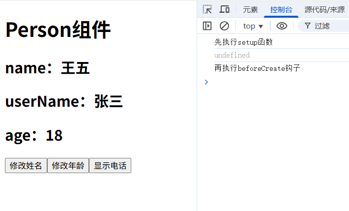

## setup语法糖（简写）

- 安装vite-plugin-vue-setup-extend插件
```bash
  npm install vite-plugin-vue-setup-extend -D
```

- 在vite.config.ts中配置插件
```ts
  import { defineConfig } from 'vite'
  import vue from '@vitejs/plugin-vue'
  // 引入vite-plugin-vue-setup-extend插件
  import vueSetupExtend from 'vite-plugin-vue-setup-extend'

  export default defineConfig({
    plugins: [vue(), vueSetupExtend()],// 使用vue和vueSetupExtend插件
  })
```

- 在组件中使用setup语法糖
  - 可以直接在script标签中添加setup属性，代表该标签内写的是setup函数，且会将内部声明的变量、函数等自动返回，不需要return
  - 使用vueSetupExtend插件，可以在script标签中添加name属性，代表组件的名称，在模板中可以直接使用组件名称
```ts
  <script setup lang="ts" name="User">
  let name = '张三';
  let age = 18;
  let tel = '12345678901';
  function changeName() {
      name = '李四';
  }
  function changeAge() {
      age++;
  }
  function showTel() {
      alert(tel);
  }
  </script>
```

- 在模板中使用组件名称
```html
  <div>
    <h1>User组件</h1>
    <h2>name：{{ name }}</h2>
    <h2>age：{{ age }}</h2>
    <button @click="changeName">修改姓名</button>
    <button @click="changeAge">修改年龄</button>
    <button @click="showTel">显示电话</button>
  </div>
```

- 在data配置项中不能通过this访问setup简写中的数据
```ts
  export default {
    name: 'User',
    data() {
      return {
        userName: this.name,// 在data中不能通过this访问setup简写中的数据,userName为undefined
      }
    },
  }
```

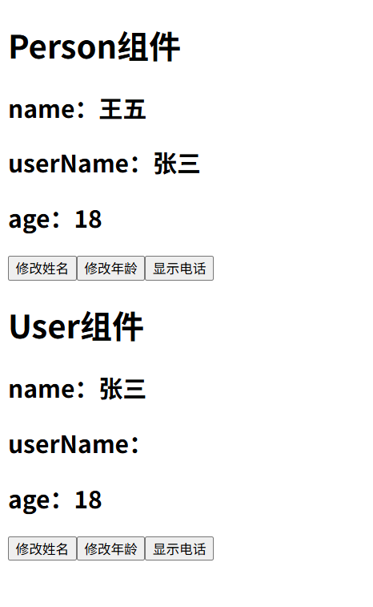

# ref函数

- ref函数用于创建响应式数据

## ref函数的使用

- 引入ref函数，用于创建响应式数据
```ts
  import { ref } from 'vue'
```

- 使用ref创建响应式数据
- ref函数返回的是一个RefImpl对象（ref对象）
  - ref对象中包含value等属性，值为ref函数的参数
  - ref对象不是响应式的，value属性是响应式的
  - 如果传入的参数为引用类型，ref函数会通过reactive函数将引用类型数据转换为响应式对象，则value属性值为Proxy对象(reactive函数会基于Proxy实现响应式，后面再讲)
```ts
  // 使用ref创建基本类型的响应式数据
  let name = ref('张三');
  // 使用ref创建对象类型的响应式数据
  const car = ref({
    brand: '奔驰',
    price: 1000000,
  })
  console.log(car.value);// Proxy(Object)
  // 使用ref创建数组类型的响应式数据
  const phones = ref([
    {
      id: 1,
      brand: '小米',
      price: 3000,
    },
    {
      id: 2,
      brand: '华为',
      price: 4000,
    },
  ])
  console.log(phones.value);// Proxy(Array) 
```

- 在js中可以查看和修改.value，修改后页面会自动更新
```ts
  function changeName() {
    // 直接修改name.value，页面会自动更新
    name.value = '李四';
    console.log(name.value);// 李四
  }
  function changeCarPrice() {
    // 直接修改car.value.price，页面会自动更新
    car.value.price = 800000;
  }
  function deletePhone(id: number) {
    phones.value = phones.value.filter((phone) => phone.id !== id);
  }
```

- 可以在模板中直接使用ref数据，不需要.value
```html
  <!-- 模板中直接使用name，不需要name.value -->
  <h2>姓名：{{ name }}</h2>
  <button @click="changeName">修改姓名</button>
  <h2>车信息：</h2>
  <!-- 模板中直接使用car.brand -->
  <p>车品牌：{{ car.brand }}</p>
  <!-- 模板中直接使用car.price -->
  <span>车价：{{ car.price }}</span>
  <button @click="changeCarPrice">修改车价</button>
  <h2>手机信息：</h2>
  <div v-for="phone in phones" :key="phone.id">
    <span>{{ phone.brand }}：{{ phone.price }}</span>
    <button @click="deletePhone(phone.id)">删除</button>
  </div>
```

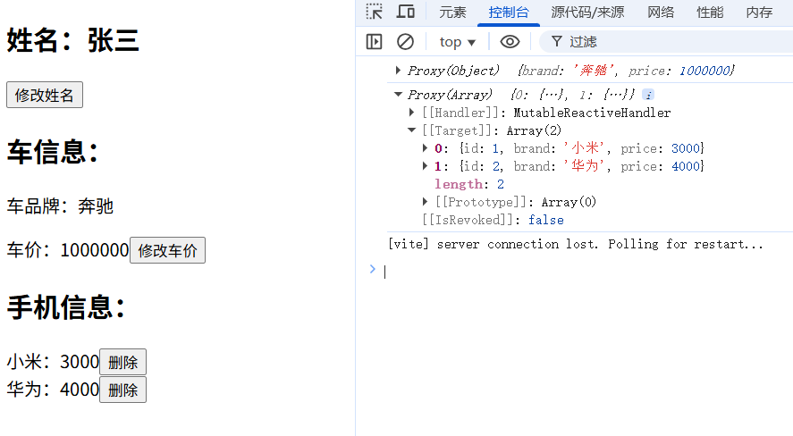

## 使用Vue扩展插件自动补全.value

- vs code安装volar扩展插件
  - Vue (Official)

- 设置 -> 扩展 -> Vue -> Auto Insert Dot Value -> 开启

- 当使用ref数据时，编辑器会自动补全.value

# reactive函数

- reactive函数用于创建`响应式对象`
  - reactive函数返回的是一个Proxy对象
  - reactive函数只能创建对象类型的响应式数据，不能创建基本类型的响应式数据
  - reactive函数创建的响应式对象是深度响应式的，属性值如果是引用类型，会递归转换为响应式对象。（ref函数创建的响应式对象是通过reactive函数实现的，所以也是深度响应式的）
- 实现原理
  - reactive函数基于Proxy实现响应式，当访问或修改对象的属性时，会触发Proxy的get和set拦截器，从而实现响应式更新

## reactive函数的使用

- 引入reactive函数，用于创建响应式对象
```ts
  import { reactive } from 'vue'
```

- 使用reactive创建响应式对象，该对象是深度响应式的
  - reactive函数返回的是一个Proxy对象，该对象的属性值如果是引用类型，会递归转换为Proxy响应式对象。
```ts
  // 使用reactive创建对象类型的响应式数据，该对象是深度响应式的
  const user = reactive({
    name: '张三',
    age: 18,
    car: {
      brand: '奔驰',
      price: 1000000,
    },
    phones: [
      {
        id: 1,
        brand: '小米',
        price: 3000,
      },
      {
        id: 2,
        brand: '华为',
        price: 4000,
      },
    ]
  })
```

- 可以在js中查看和修改reactive数据，修改后页面会自动更新
```ts
  function changeCarPrice() {
    // 直接修改user.car.price，页面会自动更新
    user.car.price = 800000;
  }
  console.log(user.car);// Proxy(Object)

  function deletePhone(id: number) {
    const index = user.phones.findIndex((phone) => phone.id === id);
    if (index !== -1) {
      user.phones.splice(index, 1);
    }
  }
  console.log(user.phones);// Proxy(Array)
```

- 可以在模板中直接使用reactive数据
```html
  <h2>车信息：</h2>
  <!-- 模板中直接使用user.car.brand -->
  <p>车品牌：{{ user.car.brand }}</p>
  <!-- 模板中直接使用user.car.price -->
  <span>车价：{{ user.car.price }}</span>
  <button @click="changeCarPrice">修改车价</button>
  <h2>手机信息：</h2>
  <div v-for="phone in user.phones" :key="phone.id">
    <span>{{ phone.brand }}：{{ phone.price }}</span>
    <button @click="deletePhone(phone.id)">删除</button>
  </div>
```

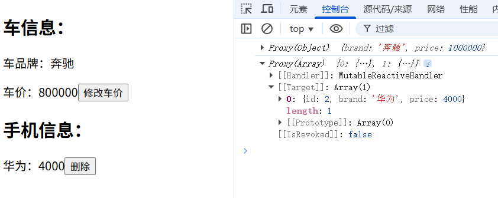

## reactive函数的局限性

- reactive重新分配一个新对象，会导致响应式丢失。可以使用Object.assign()等方法修改原有对象，保持响应式。
```ts
  function changeUser() {
    const newUser = {
      name: '李四',
      age: 20,
      car: {
        brand: '宝马',
        price: 1200000,
      },
      phones: [
        {
          id: 3,
          brand: 'oppo',
          price: 3500,
        },
        {
          id: 4,
          brand: '魅族',
          price: 3200,
        },
      ]
    }
    // reactive重新分配一个新对象，会导致响应式丢失，页面不会自动更新
    // 直接将newUser赋值给user，会导致响应式丢失
    // user = newUser;
    // 即使使用reactive重新包装newUser，也会导致响应式丢失
    // user = reactive(newUser);
    // 解决方法：使用Object.assign()方法，将newUser的属性赋值给user
    Object.assign(user, newUser);
  }
```

# ref对比reactive

## 区别

- ref既可以创建基本类型的响应式数据，也可以创建对象类型的响应式数据。而reactive只能创建对象类型的响应式数据
- ref创建的变量必须使用.value访问和修改（可以通过volar插件自动添加.value），而reactive创建的变量可以直接访问和修改
- reactive重新赋值会丢失响应式，而ref可以给value赋值，不会丢失响应式

## 使用原则

- 基本类型的响应式数据建议使用ref创建
- 对象类型的响应式数据建议使用reactive创建

# toRefs函数与toRef函数

- toRefs函数用于将`ref和reactive`创建的响应式对象转换为普通对象，普通对象的每个属性都是ref响应式数据
- toRef函数用于将`ref和reactive`创建的响应式对象的属性转换为ref响应式数据

## toRefs函数的使用

- 场景
  - 当将ref数据{name: '张三', age: 18}通过let {name, age} = user解构基本数据类型时，name和age不是响应式的，修改name或age不会触发响应式更新
```ts
  const user = ref({
    name: '张三',
    age: 18,
    car: {
      brand: '奔驰',
    }
  })
  // 从user.value中解构出name、age和car
  let { name, age, car } = user.value;
  function changeName() {
    // 直接修改name，页面不会自动更新，因为解构出来的基本数据类型不是响应式的
    name = '李四';
  }
  function changeAge() {
    // 直接修改age，页面不会自动更新
    age += 1;
  }
  function changeCarBrand() {
    // 直接修改car.brand，页面会自动更新，因为解构出来的引用类型是响应式的
    car.brand = '宝马';
  }
```
- 解决方法
  - 使用toRefs函数将user转换为普通对象，普通对象的每个属性都是ref响应式数据
```ts
  // 从user.value中解构出name、age和car的ref响应式数据
  let { name, age, car } = toRefs(user.value);
  console.log(name);// ObjectRefImpl

  function changeName() {
    // 正确的修改方式是使用name.value
    name.value = '李四';
    // 修改后，user.value.name也会自动更新为李四
    console.log(user.value.name);// 李四
  }
  function changeAge() {
    // 正确的修改方式是使用toRefs将age转换为ref响应式数据，然后使用age.value修改
    age.value += 1;
  }
  function changeCarBrand() {
    // 正确的修改方式是使用toRefs将car转换为ref响应式数据，然后使用car.value.brand修改
    car.value.brand = '宝马';
  }
```

## toRef函数的使用

- 场景
  - 当需要将响应式对象的属性转换为ref响应式数据时，使用toRef函数
- 解决方法
  - 使用toRef函数将响应式对象的属性转换为ref响应式数据
- toRef函数的参数
  - 第一个参数：响应式对象
  - 第二个参数：属性名
- toRef函数的返回值
  - ref响应式数据
```ts
  // 从user.value.car中解构出brand的ref响应式数据
  let carBrand = toRef(user.value.car, 'brand');
  console.log(carBrand);// ObjectRefImpl
  function changeCarBrandByRef() {
    // 正确的修改方式是使用carBrand.value修改
    carBrand.value = '奔驰';
  }
```

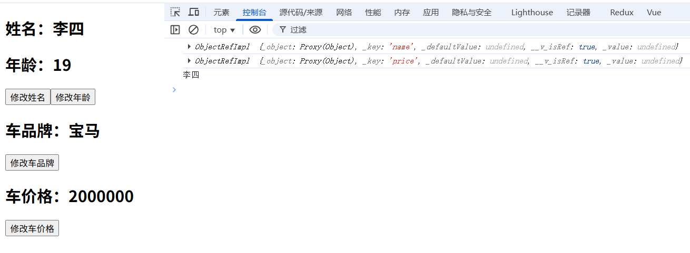

# 计算属性

- 通过已有响应式数据计算出新的响应式数据
- 计算属性会缓存计算结果，只有依赖值变化时才会重新计算

- 引入计算属性函数computed
```ts
  import { reactive, computed } from 'vue'
```

- 使用computed创建`只读`的计算属性
  - computed函数的参数可以是一个函数，函数返回值是ref响应式数据ComputedRefImpl
  - 该方式创建的计算属性是只读的，不能直接修改计算属性的值，只能通过修改依赖值来触发计算属性的重新计算
```ts
  // 使用computed创建只读的计算属性，计算全名，会在依赖值变化时自动更新
  const fullName = computed(() => {
    return person.firstName + person.lastName;
  })
  console.log(fullName);// ComputedRefImpl
  // 该方式创建的计算属性是只读的，不能直接修改计算属性的值
  fullName.value = '李四'
```

- 使用computed创建`可读可写`的计算属性
  - computed函数的参数可以是一个对象，对象有get和set方法
  - get方法返回计算属性的值，set方法用于修改计算属性的值
```ts
  // 创建可读可写的计算属性
  const fullName = computed({
    get: () => {
      return person.firstName + person.lastName;
    },
    // 当fullName.value被赋值时，会调用set函数
    set: (newValue) => {
      // 更新 firstName 和 lastName
      person.firstName = newValue.slice(0, 1);
      person.lastName = newValue.slice(1);
    }
  })
  // 直接修改计算属性的值，会触发set函数
  function changeFullName() {
    fullName.value = '李四';
  }
```

- 在模板中使用计算属性
```html
  <div>
    姓：<input type="text" v-model="person.firstName">
    名：<input type="text" v-model="person.lastName">
    全名：<span>{{ fullName }}</span>
    <button @click="changeFullName">修改全名</button>
  </div>
```

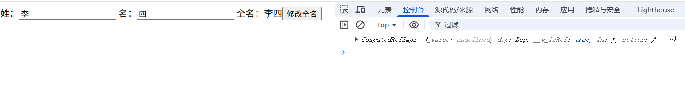

# 监视属性

- 当监视的数据发生变化时，执行某些操作（和vue2的监视属性作用相同）
- Vue3的监视属性只能监视以下四种数据
  - ref定义的数据
  - reactive定义的数据
  - 函数返回一个值（getter函数）
  - 一个包含上述内容的数组

## watch函数的使用

- 引入watch函数
```ts
  import { watch } from 'vue'
```

- watch函数的参数
  - 第一个参数：需要监视的数据
  - 第二个参数：数据变化时执行的回调函数
  - 第三个参数：可选参数，配置对象
    - deep：是否开启深度监视，默认值为false
    - immediate：是否立即执行回调函数，默认值为false
  - 返回值：一个函数，用于停止监视
```ts
  // 监视name
  const stopWatch = watch(name, (newValue, oldValue) => {
    console.log('name变化了', newValue, oldValue)
    // 当name的值为'李四'时，停止监视
    if (newValue === '李四') {
      stopWatch()
    }
  })
```

## 监视ref的基本类型数据

- 当ref定义的基本类型数据发生变化时，会触发watch函数的回调函数
  - newValue：新值
  - oldValue：旧值
```ts
  const sum = ref(0)
  watch(sum, (newValue, oldValue) => {
    console.log('sum变化了', newValue, oldValue)
  })
```
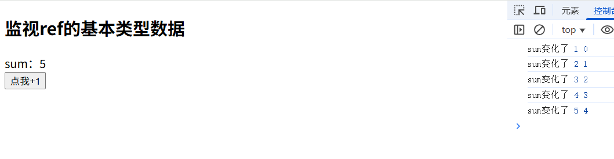

## 监视ref定义的响应式对象

- 浅监视
  - 当修改响应式对象的value时才会触发回调函数，修改响应式对象的属性时都不会触发回调函数
```ts
  const user = ref({
    name: '张三',
    age: 18
  })
  watch(user, (newValue, oldValue) => {
    console.log('浅监视，user变化了', newValue, oldValue)
  })
```
- 深监视
  - 通过第三个参数配置deep为true开启深监视
  - 当修改响应式对象的value或者修改响应式对象的属性时都会触发回调函数
  - 当修改的值是对象内的属性时，newValue和oldValue相同，且都是最新的对象
```ts
  watch(user, (newValue, oldValue) => {
    console.log('深监视，user变化了', newValue, oldValue)
  }, {
    deep: true,
    // 初始化时是否触发回调函数，默认false
    immediate: true
  })
```
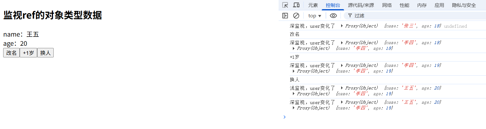

## 监视reactive定义的响应式对象

- 当修改响应式对象的属性时会触发回调函数
- 强制开启深度监视，且不可关闭，配置deep为false一样会触发深度监视
- newValue和oldValue相同，且都是最新的user对象
```ts
  const user = reactive({
    name: '张三',
    age: 18
  })
  watch(user, (newValue, oldValue) => {
      console.log('reactive监视，user变化了', newValue, oldValue)
      console.log(newValue === oldValue);// true
  })
```
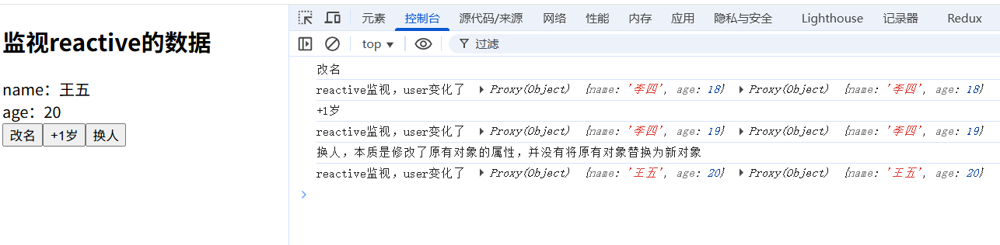

## 监视ref&reactive响应式对象中的属性

- getter函数的概念
  - 无形参，返回一个值

- 先定义一个多层对象
```ts
  const user = reactive({
    name: '张三',
    car: {
      brand: '奔驰',
      price: 1000000
    }
  })
```

### 监视基本数据类型属性

- 如果需要监听ref的对象的基本数据类型属性，需要使用getter函数返回需要监听的属性值
- 回调函数的参数newValue和oldValue分别是属性的新值和旧值
```ts
  watch(() => user.value.name, (newValue, oldValue) => {
    console.log('name变化了', newValue, oldValue)
  })
```

### 监视对象属性

- 直接监视该对象（不推荐）
  - 强制深度监视，且不能关闭深度监视
  - 只能监视该对象内的属性变化，不能监视对象自身
  - 当直接替换响应式对象中的该对象时，不会触发回调函数，且会丢失监视该对象的属性变化
  - 不建议使用该方式，建议使用getter函数返回需要监视的对象
```ts
  // 当直接修改user.value.car时，不会触发回调函数，且会丢失监视car的属性变化
  watch(user.car, (newValue, oldValue) => {
    console.log('car的属性变化了', newValue, oldValue)
  })
```

- 使用getter函数返回需要监视的对象（推荐）
  - 可以监视对象自身的变化
  - 开启深度监视后，可以监视对象内的属性变化
```ts
  watch(() => user.car, (newValue, oldValue) => {
    console.log('car变化了', newValue, oldValue)
  }, {
    deep: true
  })
```

### 监视ref响应式对象中的属性

- 与reactive响应式对象中的属性监视相同，只是需要.value

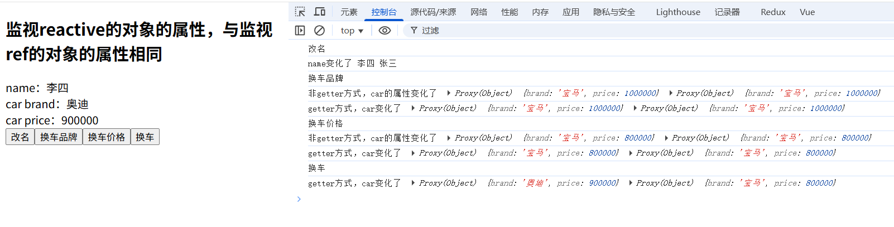

## 监视多个响应式对象

- 第一个参数为数组，数组元素为需要监视的数据，按需写数据或者getter函数返回属性值
- 可以同时监视多个响应式对象
- 每个响应式对象的变化都会触发回调函数
-  newValue为新数组，oldValue为旧数组，数组元素为对应属性的新值或旧值
```ts
  watch([() => user.name,() => user.car], (newValue, oldValue) => {
    console.log('name或car变化了', newValue, oldValue)
  }, {
    deep: true
  })
```
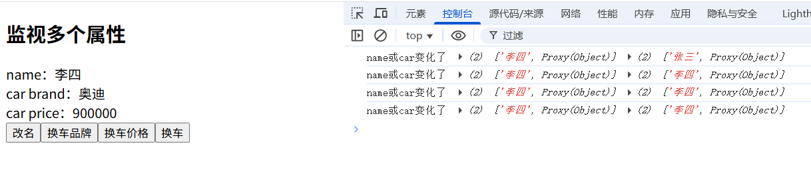

# watchEffect

- 自动收集响应式数据的依赖，当依赖发生变化时会触发回调函数
- 类似watch，但是不需要指定需要监视的数据，而是自动收集函数中的依赖数据
- 默认开启深度监视(deep:true)和立即执行回调函数(immediate:true)
```ts
  // 由于函数内依赖了user.age和user.car.brand，所以当这两个数据变化时，会自动执行函数
  // 这里有个坑，由于if语句用的是||，所以当user.age >= 21为true时，不会再判断user.car.brand == '奥迪'。
  // 这时候该函数就不会依赖user.car.brand，当user.car.brand变化时，也不会执行函数。
  watchEffect(() => {
    console.log('user.age或user.car.brand变化了');
    if(user.age >= 21 || (user.car.brand == '奥迪')) {
      console.log('让李四或者开奥迪的人去买烟')
    }
  })
```
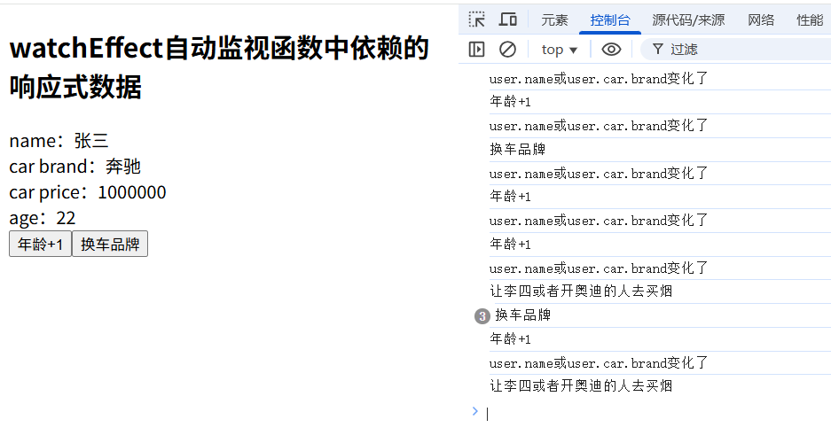

# vue3引入和使用组件

- 引入组件后，会自动注册组件
```ts
  // 引入组件，会自动注册组件
  import Person from './components/Person.vue'
```
- 可以在模板中使用组件标签
```html
  <template>
    <div>
      <Person />
    </div>
  </template>
```

# 标签的ref属性

- 可以给普通标签或vue组件添加ref属性，用于获取标签/组件的内容
  - 普通标签的ref属性值为HTML元素的引用
  - vue组件的ref属性值为组件的实例

## 普通标签的ref属性

- 在模板中添加ref属性
```html
  <template>
    <div>
      <h2 ref="titleRef">这是一个标题</h2>
    </div>
  </template>
```

- 在脚本中使用ref函数关联普通标签
```ts
  import { ref } from 'vue'
  const titleRef = ref<HTMLHeadingElement>()
```

- 在脚本中使用titleRef.value获取普通标签的引用
```ts
  console.log(titleRef.value); // <h2 ref="titleRef">这是一个标题</h2>
```

## 组件的ref属性

- 在组件中导出需要暴露的数据
```ts
  // Person.vue组件
  <script lang="ts" setup name="Person">
    import { ref } from 'vue'
    const title = ref('这是一个标题')
    // 导出title，用于在外部获取组件的标题
    export { title }
  </script>
```

- 在模板中添加ref属性
```html
  <template>
    <div>
      <Person ref="personRef" />
    </div>
  </template>
```

- 在脚本中使用ref函数关联vue组件
```ts
  import { ref } from 'vue'
  const personRef = ref<InstanceType<typeof Person>>()
```

- 在脚本中使用personRef.value获取vue组件的实例和导出的数据
```ts
  console.log(personRef.value); // Person组件的实例
  console.log(personRef.value?.title); // 这是一个标题
```

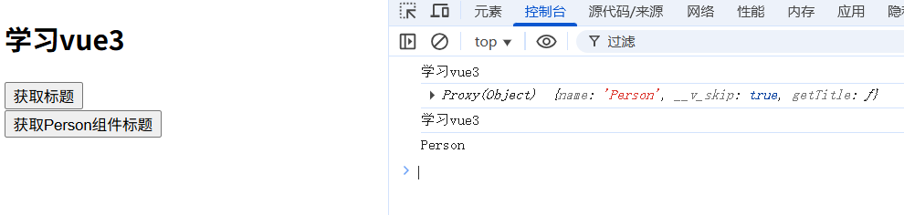

# Props

- 组件的props用于接收外部传递的数据

## 父组件中定义响应式数据，并传递给子组件

- 父组件中定义响应式数据
```ts
  import { type IPerson } from './types/index'
  import { reactive } from 'vue'
  const name = 'App'
  // 定义一个响应式的数组，用于存储人员列表
  const personList: IPerson[] = reactive([
      {id: '1', name: '张三', age: 18},
      {id: '2', name: '李四', age: 20},
      {id: '3', name: '王五', age: 22},
  ])
```

- 父组件中传递props给子组件
```html
  <template>
    <div>
      <!-- 传递person和sourceName给子组件 -->
      <Person v-for="person in personList" :key="person.id" :person="person" :sourceName="name" />
    </div>
  </template>
```

## 子组件中接收和使用props

- 通过defineProps函数接收props
- defineProps函数返回的是一个响应式对象，当父组件传递的数据发生变化时，props也会同步更新

- 使用数组接收props，类似vue2的props选项
```ts
  import { defineProps } from 'vue'
  const props = defineProps(['person', 'sourceName']);
```

- 使用配置项接收props，类似vue2的props选项
  - 可以用type属性指定props的类型
  - 可以用required属性指定props是否必填
  - 可以用default属性指定props的默认值
```ts
  import { defineProps } from 'vue'
  import { type IPerson } from '../types/index'
  const props = defineProps({
    person: {
      type: Object as () => IPerson,// 类型限制
      required: true,// 是否必填
      default: () => ({ id: '', name: '', age: 0 }),// 默认值
    },
    sourceName: {
      type: String as () => string,// 类型限制
      required: false,// 是否必填
      default: () => '默认来源',// 默认值
    },
  })
```

- 使用泛型和withDefaults函数接收props
  - 可以用泛型指定props的类型
  - 可以用withDefaults函数指定props的默认值
```ts
  import { defineProps, withDefaults } from 'vue'
  import { type IPerson } from '../types/index'
  type Props = {
    person: IPerson;
    sourceName?: string;// 可选值
  }
  const props = withDefaults(defineProps<Props>(), {
    // 对象必须写成函数的形式，否则会报错
    person: () => ({ id: '', name: '', age: 0 }),
    // 基本数据类型可以直接赋值,也可以写成函数的形式
    // sourceName: '默认来源',
    sourceName: () => '默认来源',
  })
```

- 可以在模板中使用props
```html
  <template>
    <div>
      <span> 来源：{{ props.sourceName }}，姓名：{{ props.person.name }}，年龄：{{ props.person.age }}</span>
    </div>
  </template>
```

## 当父组件传递的props被修改时，子组件会自动更新

- 父组件中修改props会自动更新子组件的props
```ts
  // 父组件中修改props
  const addPerson = () => {
    const newId = (personList.length + 1).toString()
    // 当修改personList时,Person组件的props也会自动更新
    personList.push({ id: newId, name: '工号' + newId, age: 25 })
  }
```

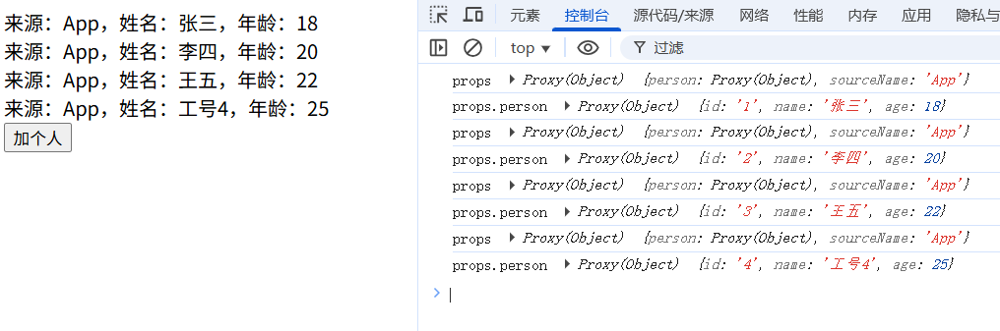

# 编译器宏函数

- Vue 3 的某些函数是编译器宏函数，不需要导入也可以在`<script setup>`中直接使用
- 只能在 `<script setup> `中使用
- 不需要手动导入
- 类型安全 (TypeScript)

## 编译器宏的特性

- 这些函数在代码中看起来是函数调用，但在编译过程中会被 Vue 编译器识别并转换为相应的 JavaScript 代码
```ts
  // 你写的代码
  const props = defineProps<{ title: string }>()

  // 编译后的代码
  const props = __props__ // 或者更具体的运行时代码
```

## 工作原理

- 当 Vue 编译器处理你的单文件组件时
  - 解析阶段: 识别这些特殊的宏调用
  - 转换阶段: 将它们转换为对应的运行时代码
  - 生成阶段: 输出标准的 JavaScript 代码

## 构建工具支持

- Vite
  - 通过 @vitejs/plugin-vue 自动处理
- Vue CLI
  - 通过 vue-loader 自动处理
- 其他构建工具
  - 相应的 Vue 插件来处理这些宏函数

## 主要的编译器宏

### 组合式 API 相关

- defineProps
  - 用于接收父组件传递过来的数据
- withDefaults
  - 用于设置props的默认值
- defineExpose
  - 用于暴露组件的数据，使父组件可以访问到组件的部分数据
- defineEmits
  - 用于定义组件可以触发的事件

### 选项式 API 相关 (Vue 3.3+)

- defineOptions
  - 用于定义组件的选项，如name、inheritAttrs、components、props、data、computed、watch等
- defineSlots
  - 用于定义组件的插槽

### 渲染函数相关

- defineRender
  - 用于定义组件的渲染函数

# 生命周期钩子

- onBeforeMount
  - 组件挂载前调用
- onMounted
  - 组件挂载完成后调用
- onBeforeUpdate
  - 组件更新前调用
- onUpdated
  - 组件更新完成后调用
- onBeforeUnmount
  - 组件卸载前调用
- onUnmounted
  - 组件卸载完成后调用
```ts
  <script lang="ts" setup name="Person">
  // 引入ref和生命周期函数
  import { ref, onBeforeMount, onMounted, onBeforeUpdate, onUpdated, onBeforeUnmount, onUnmounted } from 'vue'
  console.log('组件初始化（setup，替代vue2的beforeCreate和created钩子）');
  onBeforeMount(() => {
    console.log('组件挂载前调用')
  })
  onMounted(() => {
    console.log('组件挂载完成后调用')
  })
  onBeforeUpdate(() => {
    console.log('组件更新前调用')
  })
  onUpdated(() => {
    console.log('组件更新完成后调用')
  })
  onBeforeUnmount(() => {
    console.log('组件卸载前调用')
  })
  onUnmounted(() => {
    console.log('组件卸载完成后调用')
  })
  </script>
```

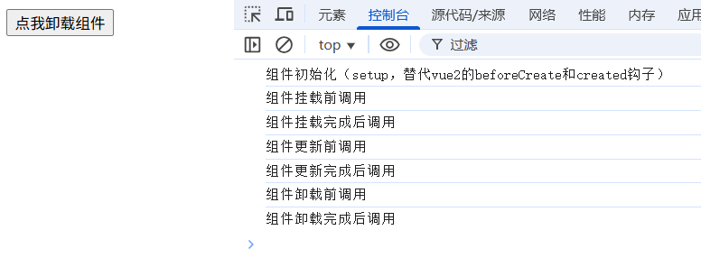

## vue3生命周期 vs vue2生命周期

- 组件初始化
  - vue3: setup
  - vue2: beforeCreate, created
- 组件挂载
  - vue3: onMounted
  - vue2: mounted
- 组件更新
  - vue3: onBeforeUpdate, onUpdated
  - vue2: beforeUpdate, updated
- 组件卸载
  - vue3: onBeforeUnmount, onUnmounted
  - vue2: beforeDestroy, destroyed

- 使用setup函数替代vue2的beforeCreate和created钩子
- 修改了钩子的名称
- 其它概念与vue2相同

# vite配置别名路径

- 配置vite别名路径
  ```ts
    // vite.config.ts
    import { defineConfig } from 'vite'
    import path from 'path'
    export default defineConfig({
      // ...其它配置
      resolve: {
        alias: {
          '@': path.resolve(__dirname, 'src'),
        },
      },
    })
  ```
- 在tsconfig.json中配置路径别名
  ```json
    {
      "compilerOptions": {
        "baseUrl": "./",
        "paths": {
          "@/*": ["src/*"]
        }
      }
    }
  ```
- 通过@符号来导入文件
  ```ts
    import {Button} from '@/components/Button';
  ```